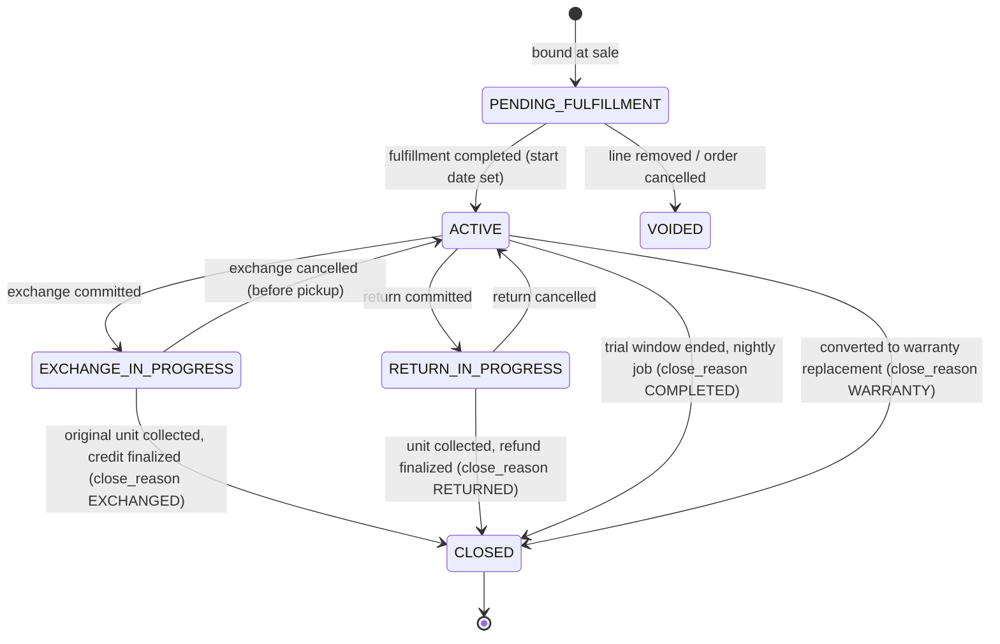

# Devin Handoff: PillowTop Sleep Trial Engine

**Status:** Implementation specification. Build in the phases in Section 33, one phase per prompt. Do not build it all at once.
**Aligns with:** Canonical Spec Section 3 (Journey/Sleep Trial), Section 13 (Returns), Section 15 (Roles & Permissions), Section 16 (Settings), Section 17 (Policy Evaluation). Where this document is more specific, it wins for the Sleep Trial domain. Where it conflicts with a canonical principle, stop and flag it.
**Builds on what already exists** (migrations 055 to 065). This is an evolution of the current code, not a greenfield rebuild. Section 26 lists what gets extended, migrated, or retired.

---

## 1. Purpose

The Sleep Trial Engine owns one question: **given this customer's mattress, their policy, and today's date, what are they entitled to, why, what does it cost, and what can the employee do next?**

It is responsible for:

- Storing each retailer's Sleep Trial policy as a versioned, company-wide policy.
- Binding a customer's policy at the moment of sale so later policy changes never change their deal.
- Tracking a trial per trial-eligible mattress unit (not per Journey).
- Evaluating eligibility for exchange and return, with an explainable result.
- Quoting comfort/restocking fees transparently.
- Enforcing protector, condition, and exchange-count rules.
- Running exceptions and approvals with a full audit trail.
- Telling the Exchange Builder and Returns domain what is allowed and at what fee.

It is **not** responsible for moving money, reserving inventory, scheduling trucks, or calculating tax. Those domains consume the engine's results (canonical 17.28: outcome is not side effect).

---

## 2. Product Principles

1. **The system knows the policy so employees don't have to.** Every screen answers: where is the customer, are they eligible, why, what does it cost, what can I do, who can approve.
2. **Explainable, never arbitrary.** Every result carries a reason code, a plain-English explanation, and the rule that produced it.
3. **Powerful underneath, simple to operate.** A simple retailer sets 5 fields. A complex retailer opens Advanced sections. One underlying model (canonical 17.77).
4. **A customer's deal is frozen at sale.** Policy changes apply to future sales only unless an admin runs an explicit migration.
5. **No silent overrides.** Anything that departs from policy is an exception record with requester, approver, reason, and original result.
6. **Calculate, don't store, anything time-based.** Night count, eligibility, fee tier, expiry, and ending-soon are derived from stored facts plus today's business date.
7. **One evaluation engine.** No `if brand === X` scattered through the UI. The UI renders the engine's result.
8. **Structured, not a rules language.** Fixed policy sections with typed fields and a small set of override scopes. No free-form expressions (canonical 17.123).

---

## 3. Locked Business Rules

These are decided. Do not reopen.

| # | Rule | Source |
|---|---|---|
| L1 | Customer = relationship, Sleep Journey = the work. Exchanges and warranty stay in the same Journey. | PRD |
| L2 | Board states: Quoted, Sold, Waiting for Inventory, Ready to Schedule, Scheduled, Sleep Trial. Deposit is an event, not a state. During an exchange the Journey re-enters earlier states for the replacement (canonical 105/106). | PRD |
| L3 | Trial starts only after the qualifying mattress is actually delivered or picked up. Delivery confirmation is manual (never auto-confirmed). | PRD + shipped Sep 23 |
| L4 | Not every item gets a trial. Trial eligibility is set at category level with optional product override (existing `product_categories.sleep_trial_eligible`, `products.sleep_trial_eligible`). | PRD + 057 |
| L5 | **Sleep Trial policy is company-wide. No store overrides.** Store-level trial fields are retired. | Zach, Sep 24 |
| L6 | Exception approval authority is configurable by role. **A manager may approve their own exception only if the retailer enables it.** | Zach, Sep 24 |
| L7 | Trial length, minimum nights, and restocking fees (amounts, brands, time tiers) are retailer settings. | Zach, Sep 24 |
| L8 | Protector requirement is a toggle. When on, missing protector **blocks** the exchange; only roles with the protector override permission (default Owner and Admin) can override, with a reason. | Zach, Sep 24 |
| L9 | Returns allowed is a toggle. Returns approval required is a toggle. | Zach, Sep 24 |
| L10 | Settings must be easy: toggles first, details only appear when relevant. Any real policy question becomes an option. | Zach, Sep 24 |
| L11 | Trial counting starts the **day after** delivery/pickup by default (`trial.count_starts = DAY_AFTER_FULFILLMENT`). Retailers can choose the delivery date instead. Legacy trials (Version 0) keep counting from the delivery date. | Zach, Sep 24 |
| L12 | New tenants default to no restocking fee (canonical 13.72, 13.218). | Canonical |
| L13 | Approving an exception grants authority; it never starts an exchange by itself. | Shipped |
| L14 | Refunds and credits are based on historical sale economics, never today's price (canonical 13.69, 13.221). | Canonical |

---

## 4. Recommended New Decisions

These are my recommendations. Devin builds to them unless Zach overrides (see Section 35).

| # | Decision | Recommendation | Why |
|---|---|---|---|
| D1 | Where the policy lives | Generic `policies` + `policy_versions` tables (canonical Section 17 shape) with `policy_type = 'SLEEP_TRIAL'`. Only SLEEP_TRIAL is implemented now. | Matches the canonical policy engine so other policy types can reuse it later without a redesign. |
| D2 | Policy binding moment | **At sale commitment** (Journey enters Sold). Terms are resolved and frozen per trial item then. | Zach's rule: bought in March keeps March policy. Delivery date can drift weeks. |
| D3 | Trial granularity | **One trial item per trial-eligible mattress unit.** Quantity 2 creates 2 trial items. Journey shows a rolled-up summary. | Different delivery dates, brands, and exchange histories per mattress. |
| D4 | Override scopes | Company default, then Category, Brand, Product, Condition. Single-dimension scopes only. No store scope (L5). Promotion scope is post-MVP but reserved. | Deterministic, explainable, no equal-specificity conflicts. |
| D5 | Precedence | Per field, most specific wins: **Condition > Product > Brand > Category > Company**. Exceptions sit above policy but are case-specific artifacts, not policy. | Condition describes the actual unit sold (clearance "as-is" beats a product promo). |
| D6 | Minimum nights meaning | Minimum M = customer must complete M nights. Eligible starting the date of Night M+1 (the morning after Night M). | Matches "keep it 30 nights" in plain English. Fixes current label drift. |
| D7 | Trial end meaning | Trial of T nights covers Nights 1 to T. Customer may start an action through the end of the business date `start + T` (the morning after Night T). Expired the day after that. | Matches current shipped math (`expired = today > start + T`). |
| D8 | Fee basis default | Returned unit's **net selling price at sale** (after line discounts and bundle allocation, before tax, excluding delivery and accessories). Option: pre-discount selling price. | Transparent, historical, matches refund principles (L14). |
| D9 | Protector check timing | Evaluated **live at action time** (protector later returned = no longer counts), not frozen at sale. | Protector returns after the sale must matter. |
| D10 | Self-approval model | Separate permission `sleep_trial.approve_own_exceptions`. When the requester has it, the exception is recorded as **self-authorized** (one record, no pending queue). Without it, route to another approver. | Satisfies L6 and canonical 15.54/15.55 (no fake approval requests, but still an auditable exception). |
| D11 | Permissions | 10 Sleep Trial permission keys (Section 27), not 50. Per-exception-type authority is handled by policy fields, not more permissions. | Balance of power and simplicity. |
| D12 | Authoritative calculation | A Postgres function evaluates trial items. The UI never computes eligibility itself. The existing client `trialStatus()` becomes a display helper over the server result. | Canonical 43: backend owns trial math. The app has no separate backend server. |
| D13 | Business date | Add `companies.business_timezone` (required) plus `stores.timezone` (optional override). A trial item's "today" is the business date in the timezone of the Journey's store, falling back to the company timezone. | PillowTop is SaaS: one retailer can have stores in several timezones. Policy stays company-wide (L5); timezone is a location fact, not a policy override. |
| D14 | Replacement trial | Governed by the **original** bound policy version (the customer's deal), resolved against the replacement product's scopes. Exchange count carries across the whole chain. | Customer keeps their deal; brand rules still apply to the new brand. |
| D15 | Split King | Default **Independent** (each side is its own trial item). Option **Paired** (sides share an exchange count). `pair_group_id` built now. | Most common real behavior; paired is architecture-ready. |
| D16 | Eligibility and fee lock | Locked when the exchange/return is **initiated** (committed in the Exchange Builder), not when completed. | Customer who starts on the last valid day is protected. |
| D17 | Delivery/redelivery fees | Owned by Delivery pricing, not Sleep Trial. Sleep Trial exposes facts (`is_trial_exchange`, `exchange_number`) Delivery pricing can use. | No duplicate fee systems. |
| D18 | Policy changes | Draft then Publish. Publishing affects future sales only. Applying to active trials is a separate, explicit, post-MVP migration command. | Prevents changing 2,000 active customers by accident. |
| D19 | Templates and Test Policy | Both MVP. Templates are cheap. Test Policy reuses the real evaluator with hypothetical facts. | Makes complex policy safe to configure. |

---

## 5. Settings Architecture

### 5.1 Navigation

**Settings → Sleep Trial**

The page has a status header and 9 sections as a left-side list (tabs on narrow screens):

```
Sleep Trial Policy                     [Draft has unsaved changes]  [Test a Scenario]  [Publish]
Currently active: Version 4, published Sep 12 by Zach Roesch

  1. Overview
  2. Trial Terms
  3. Exchanges
  4. Returns
  5. Fees
  6. Protector
  7. Product Rules
  8. Approvals & Exceptions
  9. Customer Communication
```

**Overview** shows a plain-English summary generated from the definition (canonical 17.78), for example:

> Customers get a 120-night sleep trial starting the day their mattress is delivered or picked up. They can exchange after 30 nights. One exchange is allowed. A qualifying mattress protector is required. There is no exchange fee. Returns are not allowed. Clearance mattresses have no trial. Helix mattresses have a 100-night trial.

Overview also shows: active version, draft status, number of active trials on each version, and a "Start from a template" option when no policy exists yet.

### 5.2 Draft and Publish

- All edits write to a single **Draft** version. Nothing changes for anyone until Publish.
- **Publish** runs validation (Section 31), then shows an impact preview: "This applies to sales made on or after [today]. 214 active trials and 37 sold-not-delivered items keep their current terms." Requires permission `sleep_trial.manage_policy`.
- Every field below shows a small "Affects future sales only" note in the draft.
- **Discard draft** available.
- Only one Published (active) version at a time. Publishing retires the previous one (`effective_until` set). Canonical 17.68.

### 5.3 Field Reference

Legend: **Dep** = only shown when this is true. **Ovr** = can be overridden in Product Rules. All fields require `sleep_trial.manage_policy` to edit. All changes affect **future bindings only** (D18).

#### Section 2: Trial Terms

| Field key | Label | Type | Default | Values / validation | Dep | Ovr |
|---|---|---|---|---|---|---|
| `trial.enabled` | Offer a sleep trial | toggle | on | | | yes |
| `trial.length_nights` | Trial length (nights) | integer | 120 | 1 to 730 | trial.enabled | yes |
| `trial.minimum_nights` | Nights before exchange is allowed | integer | 30 | 0 to length_nights - 1. 0 = no minimum | trial.enabled | yes |
| `trial.start_event` | Trial starts on | select | `FULFILLMENT_COMPLETED` | `FULFILLMENT_COMPLETED` (delivery or pickup date). Reserved: `SALE_DATE` | trial.enabled | no |
| `trial.count_starts` | Night 1 is | select | `DAY_AFTER_FULFILLMENT` | `DAY_AFTER_FULFILLMENT`, `FULFILLMENT_DATE` | trial.enabled | no |
| `trial.ending_soon_days` | Show "ending soon" this many days before the end | integer | 14 | 0 to 60 | trial.enabled | no |
| `trial.extensions_allowed` | Allow trial extensions | toggle | on | | trial.enabled | yes |
| `trial.max_extension_nights` | Most extra nights per trial | integer | 30 | 1 to 365 | extensions_allowed | yes |
| `trial.checkin_nights` | Automatic check-in follow-ups on nights | list of integers | [14] | each 1 to length. Empty = none | trial.enabled | no |
| `trial.eligibility_reached_task` | Create a follow-up when exchange eligibility is reached | toggle | off | | minimum_nights > 0 | no |
| `trial.ending_soon_task` | Create a follow-up when ending soon starts | toggle | off | | | no |

#### Section 3: Exchanges

| Field key | Label | Type | Default | Values / validation | Dep | Ovr |
|---|---|---|---|---|---|---|
| `exchange.allowed` | Allow comfort exchanges | toggle | on | | trial.enabled | yes |
| `exchange.max_count` | Exchanges allowed per trial | integer | 1 | 1 to 5 | exchange.allowed | yes |
| `exchange.replacement_trial` | What the replacement gets | list per exchange number | `[{n:1, rule:FULL_NEW}]` | rule: `FULL_NEW`, `REMAINING`, `FIXED`, `NONE`; FIXED requires `nights` 1 to 730. List length = max_count; missing entries default to NONE | exchange.allowed | yes |
| `exchange.replacement_minimum` | Minimum nights on a replacement | select | `SAME_AS_POLICY` | `SAME_AS_POLICY`, `NONE`, `FIXED` (+nights) | exchange.allowed | yes |
| `exchange.downgrade_difference` | When the replacement costs less | select | `STORE_CREDIT` | `REFUND_ORIGINAL`, `STORE_CREDIT`, `NOT_REFUNDED` | exchange.allowed | no |
| `exchange.require_concern` | Require a documented sleep concern before an exchange | toggle | off | | exchange.allowed | no |
| `exchange.require_concern_age_days` | Concern must be at least this many days old | integer | 0 | 0 to 60 | require_concern | no |
| `exchange.early_exception_allowed` | Allow early exchange exception requests | toggle | on | | minimum_nights > 0 | yes |
| `exchange.expired_exception_allowed` | Allow exchange requests after the trial ends | toggle | on | | exchange.allowed | yes |
| `exchange.cross_brand_allowed` | Replacement can be a different brand | toggle | on | | exchange.allowed | no |
| `exchange.size_change_allowed` | Replacement can be a different size | toggle | on | | exchange.allowed | no |

#### Section 4: Returns

| Field key | Label | Type | Default | Values / validation | Dep | Ovr |
|---|---|---|---|---|---|---|
| `return.allowed` | Allow sleep trial returns | toggle | off | | trial.enabled | yes |
| `return.approval_required` | Returns need approval | toggle | on | | return.allowed | yes |
| `return.exception_allowed` | Allow return exception requests when returns are off | toggle | on | | not return.allowed | yes |
| `return.minimum_nights` | Nights before a return is allowed | select | `SAME_AS_EXCHANGE` | `SAME_AS_EXCHANGE` or integer | return.allowed | yes |
| `return.refund_method` | Refund as | select | `ORIGINAL_TENDER` | `ORIGINAL_TENDER`, `STORE_CREDIT`, `CUSTOMER_CHOICE` | return.allowed | no |

#### Section 5: Fees

Basic mode (always visible):

| Field key | Label | Type | Default | Values / validation | Dep | Ovr |
|---|---|---|---|---|---|---|
| `fees.exchange_fee_enabled` | Charge an exchange fee | toggle | off (L12) | | exchange.allowed | via schedule |
| `fees.exchange_simple` | Exchange fee | fee amount | 0% | percent 0 to 100 and/or flat $0 to $5,000 | exchange_fee_enabled, advanced off | via schedule |
| `fees.return_fee_enabled` | Charge a return (restocking) fee | toggle | off | | return.allowed or return.exception_allowed | via schedule |
| `fees.return_simple` | Return fee | fee amount | 0% | same as above | return_fee_enabled, advanced off | via schedule |
| `fees.basis` | Calculate percentage fees on | select | `NET_SELLING_PRICE` | `NET_SELLING_PRICE`, `PRE_DISCOUNT_SELLING_PRICE` | any fee enabled | no |
| `fees.waiver_allowed` | Allow fee waivers or reductions by exception | toggle | on | | any fee enabled | no |

Advanced mode ("Fees change over the trial" toggle, `fees.tiered`, default off). When on, the simple fee is replaced by a **fee schedule** per action:

- `fees.schedules.<schedule_key>` : named schedules. Two built-in keys always exist: `exchange_default` and `return_default`. Brand/product rules can point to additional named schedules (Section 13).

Each schedule is an ordered list of windows. See Section 13 for the window model and validation.

#### Section 6: Protector

| Field key | Label | Type | Default | Values / validation | Dep | Ovr |
|---|---|---|---|---|---|---|
| `protector.required` | Require a mattress protector for exchanges and returns | toggle | off | | trial.enabled | yes |
| `protector.qualifying_categories` | Protector categories that count | multi-select of Product Categories | [] | at least 1 when required | required | no |
| `protector.qualifying_products` | Also count these specific products | multi-select products | [] | optional | required | no |
| `protector.purchase_window_days` | Protector can be added up to this many days after delivery | integer | 0 | 0 to 120. 0 = must be on the Journey before delivery | required | no |
| `protector.missing_behavior` | If the protector is missing | select | `BLOCK_WITH_OVERRIDE` | `BLOCK_WITH_OVERRIDE`, `APPROVAL_REQUIRED`, `WARN_ONLY` | required | no |
| `protector.applies_to` | Requirement applies to | select | `EXCHANGE_AND_RETURN` | `EXCHANGE_AND_RETURN`, `EXCHANGE_ONLY`, `RETURN_ONLY` | required | no |
| `protector.split_king_units` | A split king pair needs | select | `ONE` | `ONE`, `TWO` | required | no |

`BLOCK_WITH_OVERRIDE` means: normal users see "Blocked", holders of `sleep_trial.override_protector` see an **Override** action that records a self-authorized exception with a required reason (L8).

#### Section 7: Product Rules

A list of override rules. Each rule: **Applies to** (scope type + value) and **Change these terms** (pick from overridable fields, set values). Examples in Section 6.

Also shows, read-only, the trial eligibility inherited from the catalog: "Mattresses category: trial eligible. 3 products override." with a link to Products. Catalog eligibility stays in the catalog (L4); this page does not duplicate it.

Also in this section:

| Field key | Label | Type | Default | Values |
|---|---|---|---|---|
| `split_king.treatment` | Split king sides are treated as | select | `INDEPENDENT` | `INDEPENDENT`, `PAIRED` |
| `inspection.required` | Inspect returned mattresses before completing | toggle | off | |
| `inspection.checklist` | Inspection checklist | list of text items | ["Clean, no stains", "No damage", "Law tag attached", "Protector was used"] | 1 to 15 items |
| `inspection.photos_required` | Require photos at inspection | toggle | off | |
| `inspection.failed_behavior` | If inspection fails | select | `APPROVAL_REQUIRED` | `BLOCK`, `APPROVAL_REQUIRED` |
| `condition.stains_void_trial` | Stains or damage void the trial | toggle | off | (implemented through inspection failure) |

#### Section 8: Approvals & Exceptions

Two parts.

**Who can do what** is a checkbox grid of roles by Sleep Trial permission (Section 27). This writes role permission grants, not policy fields (permissions are not versioned like policy). Requires `employees.manage_roles`. Rows: Request exceptions, Approve exceptions, Approve their own exceptions, Override protector requirement, Start exchanges, Start returns, Correct trial dates, Manage sleep trial policy.

**Exception rules** (policy fields):

| Field key | Label | Type | Default | Values |
|---|---|---|---|---|
| `exceptions.approval_valid_days` | An approval can be used for this many days | integer | 14 | 1 to 90 |
| `exceptions.reason_required` | Require a reason code | toggle | on | |
| `exceptions.attachments_allowed` | Allow photo/document attachments | toggle | on | |
| `exceptions.self_approval_note_required` | Self-approvals require a written note | toggle | on | |

**Exception reason codes** (list, company config, not versioned): seeded with Customer hardship, Delivery problem, Incorrect recommendation, Suspected product defect, Manufacturer accommodation, Customer retention, Store error, Employee error, Management goodwill, Other. "Other" always requires a note. Codes can be renamed, reordered, or deactivated, never deleted once used.

#### Section 9: Customer Communication

| Field key | Label | Type | Default | Values |
|---|---|---|---|---|
| `communication.policy_text` | Policy text shown to customers | rich text | generated from summary | up to 5,000 chars |
| `communication.acknowledgment` | Customer acknowledgment at sale | select | `NONE` | `NONE`, `CHECKBOX`, `SIGNATURE` (reserved, post-MVP) |
| `communication.show_on_receipt` | Print policy on receipt/order | toggle | on | |

### 5.4 Templates (first-time setup)

| Template | Terms |
|---|---|
| **Simple 120-Night Exchange** | 120 nights, 30-night minimum, 1 exchange, replacement gets remaining nights, no fee, returns off, protector off |
| **Protector-Backed Exchange** | Same as Simple + protector required (block with override) + 1 full new trial for the replacement |
| **Tiered Comfort Fee** | 120 nights, 14-night minimum, tiered exchange fee 40% → 30% → 20% → 0% (Section 13 example), returns off |
| **Returns Allowed** | 100 nights, 30-night minimum, returns allowed with approval, 15% return fee, exchanges free |
| **Start from scratch** | All defaults |

Choosing a template fills the Draft. The admin reviews and publishes. Templates are seeds, not linked (canonical 15.21).

---

## 6. Policy Hierarchy / Rule Precedence

### 6.1 Scopes

| Scope type | Value | Specificity rank | MVP |
|---|---|---|---|
| `COMPANY` | (the default definition) | 0 | yes |
| `CATEGORY` | product_category_id | 1 | yes |
| `BRAND` | brand key (normalized brand text or brand_id if a brand table exists) | 2 | yes |
| `PRODUCT` | product_id (variant-level later: variant_id, rank 3.5) | 3 | yes |
| `PROMOTION` | promotion_id, bound at sale | 3.8 | reserved, post-MVP |
| `CONDITION` | `PRIME`, `FLOOR`, `CLEARANCE`, `DISPLAY`, `OPEN_BOX` (whatever conditions inventory defines) | 4 | yes |

No `STORE` scope (L5). No combined scopes (for example "Brand X in Category Y"). If a retailer needs that, they use a Product rule.

### 6.2 Resolution algorithm (per field)

```
resolve_terms(policy_version, product_facts):
  terms   = copy(policy_version.definition.base)          # company defaults
  sources = { every field: "COMPANY" }
  matching = [o for o in definition.overrides if o.scope matches product_facts]
  sort matching by specificity rank ascending            # CATEGORY first, CONDITION last
  for o in matching:
      for (field, value) in o.set:
          terms[field]   = value
          sources[field] = o.id                           # remembered for "why"
  return terms, sources
```

Because each product has exactly one category, one brand, one product id, and one condition, at most one override per scope type can match. Publish validation rejects two overrides with the same scope type and value (canonical 17.40). Result: **deterministic, no ties.**

### 6.3 Full precedence, top wins

```
Approved exception for this specific trial item and action   (case-specific, not policy)
  ↓
Resolved terms frozen on the trial item at binding          (the customer's deal)
      which were computed as:
      Condition rule > Product rule > Brand rule > Category rule > Company default
```

Current policy settings are **never** consulted for an already-bound item (canonical 17.73).

### 6.4 Examples

Company: 120 nights, 30 minimum, fee off. Overrides: Brand Helix: 100 nights. Product "Helix Midnight Luxe Promo": 365 nights. Condition Clearance: `trial.enabled = false`.

| Item | Result | Explanation shown |
|---|---|---|
| Purple Plus, Prime | 120 nights, 30 min | Company policy |
| Helix Dusk, Prime | 100 nights, 30 min | Brand rule: Helix |
| Helix Midnight Luxe Promo, Prime | 365 nights, 30 min | Product rule: Helix Midnight Luxe Promo |
| Helix Midnight Luxe Promo, Clearance | No trial | Condition rule: Clearance items have no sleep trial |

### 6.5 Overridable fields whitelist

Only these fields may appear in an override's `set`: `trial.enabled`, `trial.length_nights`, `trial.minimum_nights`, `trial.extensions_allowed`, `trial.max_extension_nights`, `exchange.allowed`, `exchange.max_count`, `exchange.replacement_trial`, `exchange.replacement_minimum`, `exchange.early_exception_allowed`, `exchange.expired_exception_allowed`, `return.allowed`, `return.approval_required`, `return.exception_allowed`, `return.minimum_nights`, `fees.exchange_schedule` (schedule key), `fees.return_schedule` (schedule key), `protector.required`. Anything else is rejected at publish.

---

## 7. Policy Versioning & Snapshotting

### 7.1 Model

- `policies`: one row per company per policy type. Stable identity.
- `policy_versions`: `DRAFT` (at most one), `PUBLISHED` (exactly one active), `RETIRED`. Published definitions are **immutable** (enforce with a trigger that rejects updates to `definition` when status is not DRAFT).
- `effective_from` = publish timestamp. `effective_until` = next publish timestamp. No overlapping published versions (canonical 17.68).
- Scheduled activation (publish now, effective next Monday) is reserved, post-MVP.

### 7.2 Binding (the snapshot)

**When:** at sale commitment, when the Journey first reaches Sold (the same moment written sales are established). For items added to the order after Sold, binding happens when they are added.

**What gets stored on each trial item (immutable after binding except by audited correction):**

- `policy_version_id`
- `resolved_terms` (JSON: every resolved field)
- `term_sources` (JSON: field → `COMPANY` or override id + human label, for explanations)
- `terms_hash` (sha256 of resolved_terms)
- `bound_at`, `bound_reason` (`SALE`, `ITEM_ADDED`, `BACKFILL`, `REPLACEMENT`, `CORRECTION`)
- Product facts snapshot used to resolve: product_id, product name, brand, category_id, category name, condition, size, firmness/comfort attributes if the catalog has them.

The fee basis is **not** frozen at sale (price can legitimately change before delivery). It is captured at trial start (Section 13.2).

### 7.3 Adoption strategy (canonical 17.74)

`HISTORICAL_VERSION_LOCKED` for the Sleep Trial domain. New versions apply only to items bound after publish.

### 7.4 Corrections

If an item was bound to the wrong terms (for example the wrong condition was recorded), a user with `sleep_trial.manage_policy` runs **Rebind Trial Terms**: choose the version (current or the originally bound one), required reason, preview the before/after, confirm. Writes a new binding, keeps the old one in `sleep_trial_item_bindings` history, logs an audit event. Never edit `resolved_terms` in place.

### 7.5 Migrating active trials (post-MVP command)

"Apply this version to active trials" is an explicit admin command with: filter (all active, or bound before date X), preview of each affected customer's before/after, required reason, and it only allows changes that are **not worse for the customer** unless a second confirmation is given. MVP ships without it; the binding-history table makes it possible later with no schema change.

### 7.6 Legacy data

Existing journeys have journey-level snapshot columns (`sleep_journeys.trial_length_nights`, `minimum_adjustment_nights`, `trial_policy_snapshot`, migration 057). The backfill in Phase 3 creates trial items bound to a synthetic **Version 0 (Legacy)** whose resolved_terms equal those columns, `bound_reason = BACKFILL`.

---

## 8. Sleep Trial Lifecycle

### 8.1 Stored vs calculated

| Property | Stored or calculated | Where |
|---|---|---|
| Bound policy version, resolved terms, sources | Stored, immutable | sleep_trial_items |
| Trial start date | Stored (business date) | sleep_trial_items.started_on |
| Fee basis per unit | Stored at start | sleep_trial_items.fee_basis_cents |
| Lifecycle status | Stored (only states changed by commands) | sleep_trial_items.status |
| Extensions granted | Stored as records | sleep_trial_exceptions (type EXTEND_TRIAL, consumed) |
| Exchange count | Calculated from the item lineage | count of closed-as-EXCHANGED ancestors |
| Current night | Calculated | evaluator |
| Minimum met / eligible date | Calculated | evaluator |
| End date (with extensions) | Calculated | evaluator |
| Current fee tier and amount | Calculated | evaluator |
| Ending soon, expired | Calculated | evaluator |
| Protector coverage | Calculated live (D9) | evaluator |
| Journey-level summary | Calculated | view over items |

### 8.2 Item status (stored)



"Minimum period" vs "exchange eligible" vs "ending soon" vs "expired but not yet closed by the job" are **calculated**, not statuses.

On `EXCHANGED`, the replacement gets a new trial item (`predecessor_item_id` = original, same `lineage_root_id`, `exchange_sequence` + 1), status PENDING_FULFILLMENT until the replacement is delivered.

### 8.3 Journey-level effect

- Journey stays in Sleep Trial while any item is ACTIVE or has an open action.
- During an exchange, the Journey follows the replacement's operational state (L2) because the replacement is a new fulfillment line.
- The existing nightly completion job changes from "journey trial ended" to: close ACTIVE items whose window ended with no open action and no pending exception; complete the Journey only when **all** trial items are CLOSED or VOIDED and no other open work exists.
- A pending exception request or an open concern **does not** block auto-close of an expired item (the customer can still request an expired-trial exception afterward), but the nightly job skips items with an approved, unconsumed exception.

---

## 9. Item-Level Trial Architecture

### 9.1 What becomes a trial item

At binding, for each Journey line item:

1. Determine catalog eligibility: `products.sleep_trial_eligible` if not null, else the category flag (L4).
2. Resolve terms for the product facts (Section 6).
3. If catalog-eligible **and** `resolved_terms.trial.enabled = true`: create one trial item **per unit of quantity** (quantity 2 → unit_index 1 and 2).
4. If catalog-eligible but the policy disables the trial (for example Clearance): create no trial item, but record on the line item `trial_ineligible_reason = 'CONDITION_RULE'` so the UI can explain "No sleep trial: Clearance item" instead of silence.

### 9.2 Split King

- A split king is two line items (two Twin XL) or one line with quantity 2 marked as a split king set. Order Builder tags them with a shared `pair_group_id` (new nullable column on journey_line_items, copied to trial items).
- `INDEPENDENT` (default): each side is fully independent (own clock if delivered separately, own exchange count, own fee on its own price).
- `PAIRED`: exchange count is shared across the pair (exchanging one side counts as the pair's exchange); each side still has its own fee on its own price; the non-exchanged side's trial clock is unaffected.
- Protector: `protector.split_king_units = ONE` means one protector unit covers the whole pair.

### 9.3 Different delivery dates

Each trial item gets `started_on` from **its own** fulfillment completion. Partial deliveries start only the delivered items. Mark Delivered at the Journey level sets the date for all undelivered trial items on the journey (current behavior), and the per-line delivered date becomes editable per item once partial fulfillment exists.

### 9.4 What the employee sees

One mattress: exactly like today, no mention of "items".
Two or more: the Sleep Trial section shows one compact card per mattress ("King · Tempur ProAdapt · Night 46 of 120 · Eligible"), the most urgent card first (Section 19). The board card shows the most urgent item plus "+1 more".

---

## 10. Eligibility Engine

### 10.1 Where it runs

A Postgres function (security definer, tenant and visibility checked, `stable`):

```
evaluate_sleep_trial_item(p_trial_item_id uuid, p_as_of date default null) returns jsonb
evaluate_sleep_trial_items(p_journey_ids uuid[], p_as_of date default null) returns setof jsonb   -- for the board
```

`p_as_of` null means today's business date for the Journey's store: `business_today(store_id)` = today in `coalesce(stores.timezone, companies.business_timezone)`. A pure TypeScript twin is **not** built; the UI renders the JSON. The Test Policy tool calls a sibling `evaluate_sleep_trial_hypothetical(p_policy_version_id, p_facts jsonb)` that runs the same internal code path (shared inner function taking terms + facts), so simulation and production can never drift.

### 10.2 Inputs (facts)

| Fact | Source |
|---|---|
| resolved_terms, term_sources, policy_version_id | trial item (frozen) |
| started_on, status, fee_basis_cents, condition, brand, product | trial item |
| as_of business date | param or company timezone |
| approved unconsumed exceptions for this item | sleep_trial_exceptions |
| consumed extension nights | sleep_trial_exceptions (EXTEND_TRIAL, APPROVED) |
| exchange_sequence, pair exchange count (if PAIRED) | lineage |
| open action on item or pair | status + exchange/return records |
| protector coverage | live query of journey line items (Section 12) |
| open/any documented concern and its age | sleep_concerns |
| pending exception on same item/action | sleep_trial_exceptions |

Missing required fact (for example no fee basis) returns `UNKNOWN` with a reason, never silently true or false (canonical 17.62).

### 10.3 Evaluation sequence

Run once per action: `EXCHANGE` and `RETURN`. Stop at the first terminal result, but always compute display fields (night, dates).

```
evaluate(item, action, today):
  t = item.resolved_terms
  # 0. Display facts, always
  if item.status == PENDING_FULFILLMENT:  return result(PENDING, "TRIAL_NOT_STARTED")
  night        = (today - item.started_on) + 1                       # Night 1 = start date
  ext          = sum(approved extension nights)
  end_date     = item.started_on + t.length_nights + ext            # last date to START an action
  eligible_on  = item.started_on + min_nights(t, action)            # date of Night min+1
  ending_soon  = today <= end_date and (end_date - today) <= t.ending_soon_days

  # 1. Closed / in progress
  if item.status == CLOSED:  return result(NOT_ELIGIBLE, "TRIAL_CLOSED_<reason>")
  if item.status in (EXCHANGE_IN_PROGRESS, RETURN_IN_PROGRESS) or pair has open action:
        return result(BLOCKED, "ACTION_IN_PROGRESS")

  # 2. Action enabled by policy?
  if action == EXCHANGE and not t.exchange.allowed:   return exception_or(NOT_ELIGIBLE, "EXCHANGES_NOT_OFFERED", allowed=false)
  if action == RETURN   and not t.return.allowed:     return exception_or(NOT_ELIGIBLE, "RETURNS_NOT_OFFERED", allowed=t.return.exception_allowed)

  # 3. Exchange count
  if action == EXCHANGE and exchanges_used >= t.exchange.max_count:
        return exception_or(NOT_ELIGIBLE, "EXCHANGE_LIMIT_REACHED", allowed=true)

  # 4. Window
  if today > end_date:  return exception_or(EXPIRED, "TRIAL_EXPIRED", allowed=t.exchange.expired_exception_allowed)
  if today < eligible_on:
        return exception_or(NOT_YET_ELIGIBLE, "MINIMUM_NIGHTS_NOT_MET", allowed=t.exchange.early_exception_allowed)

  # 5. Fee window
  window = fee_window(t, action, night)          # Section 13
  if window.outcome == PROHIBITED: return exception_or(NOT_ELIGIBLE, "FEE_WINDOW_PROHIBITED", allowed=true)
  fee = compute_fee(window, item.fee_basis_cents)  # Section 13

  # 6. Documentation requirement
  if action == EXCHANGE and t.exchange.require_concern and not concern_ok(item, t):
        return result(BLOCKED, "SLEEP_CONCERN_REQUIRED", actions=[ADD_SLEEP_CONCERN])

  # 7. Protector
  p = protector_status(item, t, action)          # Section 12
  if p == MISSING:
      behavior = t.protector.missing_behavior
      if behavior == BLOCK_WITH_OVERRIDE: return exception_or(BLOCKED, "PROTECTOR_MISSING", override_permission="sleep_trial.override_protector")
      if behavior == APPROVAL_REQUIRED:   return exception_or(APPROVAL_REQUIRED, "PROTECTOR_MISSING")
      warnings += "PROTECTOR_MISSING"

  # 8. Approval gates
  if action == RETURN and t.return.approval_required: status = APPROVAL_REQUIRED, reason "RETURN_NEEDS_APPROVAL"
  if window.outcome == APPROVAL_REQUIRED:             status = APPROVAL_REQUIRED, reason "FEE_WINDOW_NEEDS_APPROVAL"

  # 9. Apply approved exception (if any) for this item + action, not stale, not expired
  if matching_exception: replace the blocking result with ELIGIBLE, apply approved_terms (fee override etc.),
                         add "EXCEPTION_APPLIED" with exception id

  return result(status or ELIGIBLE, reason or "WITHIN_POLICY", fee, warnings, ...)
```

`exception_or(...)` returns the blocking status **plus** `exception_available` true/false and the exception type to offer. If an approved, valid exception for exactly this blocker exists, step 9 turns it into ELIGIBLE.

Order matters and is fixed: closed → in progress → action offered → count → window → fee window → documentation → protector → approval → exceptions. The **first** blocker is the headline; later checks still run in "report mode" and are listed as `additional_blockers` so the employee isn't surprised after fixing the first one (for example "Not yet eligible" **and** "No protector").

### 10.4 Output model

```json
{
  "trial_item_id": "c1f...",
  "as_of": "2026-10-20",
  "display": {
    "night": 46,
    "length_nights": 120,
    "extension_nights": 0,
    "started_on": "2026-09-05",
    "eligible_on": "2026-10-05",
    "end_date": "2026-12-03",
    "minimum_nights": 30,
    "minimum_met": true,
    "ending_soon": false,
    "exchanges_used": 0,
    "exchanges_allowed": 1
  },
  "actions": {
    "EXCHANGE": {
      "status": "ELIGIBLE",
      "reason_code": "WITHIN_POLICY",
      "explanation": "Eligible for exchange. Night 46 of 120. 20% fee applies (nights 42 to 55).",
      "fee": {
        "window": {"from_night": 42, "to_night": 55, "label": "Nights 42 to 55"},
        "percent_bp": 2000, "flat_cents": 0,
        "basis_cents": 179900, "basis_label": "Returned mattress net price",
        "amount_cents": 35980, "min_cents": null, "max_cents": null,
        "next_change": {"on": "2026-10-31", "to_percent_bp": 0}
      },
      "requires_approval": false,
      "exception_available": false,
      "exception_type": null,
      "additional_blockers": [],
      "warnings": [],
      "applied_exception_id": null
    },
    "RETURN": {
      "status": "NOT_ELIGIBLE",
      "reason_code": "RETURNS_NOT_OFFERED",
      "explanation": "Returns are not part of this customer's policy.",
      "exception_available": true,
      "exception_type": "RETURN_NOT_ALLOWED"
    }
  },
  "allowed_ui_actions": ["START_EXCHANGE", "ADD_SLEEP_CONCERN", "SCHEDULE_FOLLOW_UP", "REQUEST_RETURN_EXCEPTION", "EXTEND_TRIAL_REQUEST"],
  "policy": {
    "policy_version_id": "…", "version_label": "Version 4 (Sep 12, 2026)",
    "term_sources": {"trial.length_nights": {"source": "BRAND", "label": "Brand rule: Helix"}}
  },
  "evaluated_at": "2026-10-20T15:02:11Z"
}
```

Money is integer cents, percent in basis points (2000 = 20%). No floats (canonical 17.53).

### 10.5 Statuses

| Status | Meaning | Headline shown |
|---|---|---|
| `PENDING` | Sold, not yet delivered | "Trial starts at delivery" |
| `NOT_YET_ELIGIBLE` | Inside minimum period | "Not yet eligible, eligible Oct 5" |
| `ELIGIBLE` | Can start now within policy | "Eligible" (+ fee if any) |
| `APPROVAL_REQUIRED` | Allowed only with approval | "Approval required" |
| `BLOCKED` | Something must be fixed first (concern, protector, open action) | "Blocked: reason" |
| `NOT_ELIGIBLE` | Policy does not allow it | "Not eligible: reason" |
| `EXPIRED` | Window passed | "Trial ended Dec 3" |
| `UNKNOWN` | Missing fact | "Can't determine: reason". Never treat as eligible. |

### 10.6 Reason codes

`TRIAL_NOT_STARTED`, `TRIAL_CLOSED_EXCHANGED`, `TRIAL_CLOSED_RETURNED`, `TRIAL_CLOSED_COMPLETED`, `TRIAL_CLOSED_WARRANTY`, `ACTION_IN_PROGRESS`, `EXCHANGES_NOT_OFFERED`, `RETURNS_NOT_OFFERED`, `EXCHANGE_LIMIT_REACHED`, `TRIAL_EXPIRED`, `MINIMUM_NIGHTS_NOT_MET`, `FEE_WINDOW_PROHIBITED`, `FEE_WINDOW_NEEDS_APPROVAL`, `SLEEP_CONCERN_REQUIRED`, `PROTECTOR_MISSING`, `PROTECTOR_RETURNED`, `RETURN_NEEDS_APPROVAL`, `WITHIN_POLICY`, `EXCEPTION_APPLIED`, `NO_TRIAL_CONDITION_RULE`, `NO_TRIAL_NOT_ELIGIBLE_PRODUCT`, `MISSING_FEE_BASIS`, `MISSING_START_DATE`.

Each code has a fixed explanation template in one TS file (`lib/sleepTrial/reasons.ts`) with placeholders filled from the result. The server returns code + parameters + a default English explanation; the UI may reformat but never invent logic.

---

## 11. Minimum-Night Logic

### 11.1 Exact math

All values are **business dates** (no times) in the Journey store's timezone (`coalesce(stores.timezone, companies.business_timezone)`).

```
fulfilled_on = date the mattress was delivered or picked up (business date)
start        = fulfilled_on + 1 if count_starts = DAY_AFTER_FULFILLMENT, else fulfilled_on   (stored as started_on)
Night N      = the night of calendar date start + (N - 1)
night_today  = (today - start) + 1
eligible_on  = start + M                         (date of Night M+1, the morning after Night M)
minimum_met  = today >= eligible_on
end_date     = start + T + extension_nights      (morning after Night T+ext; last day to start an action)
expired      = today > end_date
```

Example (DAY_AFTER_FULFILLMENT): delivered Sep 4, so start = Sep 5, M = 30, T = 120.
Night 1 = Sep 5. Night 30 = Oct 4. Eligible on Oct 5. Night 120 = Jan 2. End date (last day to start) = Jan 3. Expired from Jan 4.
On the delivery date itself the trial shows "Trial starts tomorrow" (status PENDING, reason TRIAL_STARTS_TOMORROW).

M = 0: eligible on the start date itself.

### 11.2 Display rules

- Hero: "Night 46 of 120".
- Not yet eligible: "Exchange eligible **Oct 5** (after Night 30) · 12 days". Replace the current label "Exchange eligible at Night 30" which reads as if Night 30 itself is eligible.
- Trial ends: "Trial ends **Jan 3** (after Night 120)".
- With extension: "Night 125 of 150 (120 + 30 extension)".

### 11.3 Late-night fulfillment

The delivery/pickup date is the business date the employee records as completion (defaults to today in company timezone, can be backdated, never future, floor rule from 061 stays). Time of day never matters. A delivery completed at 11:50 PM on Sep 5 is Night 1 = Sep 5.

### 11.4 Overrides

- Brand/product/condition rules can change `trial.minimum_nights` (Section 6).
- An individual customer can get an **Early Exchange** exception (Section 15). This does not change the minimum; it authorizes one action.
- Return minimum can differ (`return.minimum_nights`).

### 11.5 Date corrections

Correcting the trial start (existing `correct_trial_start`, moved to item level) recalculates everything automatically because everything is derived. The correction is logged with old date, new date, reason, and who.

---

## 12. Protector Eligibility Logic

### 12.1 What counts

A **protector unit** is one unit of a line item on the **same Journey** whose product is in `protector.qualifying_categories` or `protector.qualifying_products`, that is:

- not voided, cancelled, or removed from the order,
- not returned or refunded (a return record in Received/Refunded state for that unit removes it),
- added to the Journey no later than `trial item started_on + protector.purchase_window_days`.

Customer-owned protectors never count (there is no line item). A protector sold on a **different** Journey for the same customer does not count in MVP; an employee can use the override with reason "Protector on another order". (Cross-journey linking is post-MVP; see Section 35.)

### 12.2 Allocation (deterministic)

When a Journey has more trial items than protector units:

```
units_needed(item) = 1, except PAIRED or split-king pair with split_king_units = ONE → the pair needs 1 total
sort trial items by: started_on asc, then fee_basis_cents desc, then unit_index asc
sort protector units by: size match to item first, then added_at asc
assign greedily; a protector with a size attribute prefers a same-size item
items left without a unit → protector_status = MISSING
```

Result is shown per mattress: "Protector: ✓ Qualified (Queen protector)" or "✗ Missing".

### 12.3 Enforcement

| `missing_behavior` | Normal user sees | Override path |
|---|---|---|
| `BLOCK_WITH_OVERRIDE` (default) | Blocked: "No qualifying mattress protector on this order." Start Exchange hidden. | Users with `sleep_trial.override_protector` see **Override Protector Requirement**. Requires reason code + note. Creates a self-authorized `PROTECTOR_OVERRIDE` exception bound to this item and action. |
| `APPROVAL_REQUIRED` | "Approval required: no protector". Request Exception shown. | Standard approval routing. |
| `WARN_ONLY` | Eligible, with an amber warning. | None needed. |

### 12.4 Protector changes after sale

- Protector returned after the mattress trial started: coverage lost at next evaluation; reason `PROTECTOR_RETURNED`.
- Protector exchanged for another qualifying protector: still covered (the new unit counts).
- Protector removed from the order before delivery: missing.
- If a protector override exception was consumed on an exchange, later protector changes don't affect that completed exchange.

---

## 13. Restocking / Comfort Fee Engine

### 13.1 Fee window model

```json
{
  "schedule_key": "exchange_default",
  "windows": [
    {"from_night": 1,  "to_night": 13,  "outcome": "PROHIBITED"},
    {"from_night": 14, "to_night": 27,  "outcome": "ALLOWED", "percent_bp": 4000},
    {"from_night": 28, "to_night": 41,  "outcome": "ALLOWED", "percent_bp": 3000},
    {"from_night": 42, "to_night": 55,  "outcome": "ALLOWED", "percent_bp": 2000},
    {"from_night": 56, "to_night": null, "outcome": "ALLOWED", "percent_bp": 0}
  ]
}
```

Window fields: `from_night` (int ≥ 1), `to_night` (int or null = through end, including extensions), `outcome` (`ALLOWED`, `APPROVAL_REQUIRED`, `PROHIBITED`), `percent_bp` (0 to 10000), `flat_cents` (≥ 0), `min_cents`, `max_cents` (optional caps).

Relationship with minimum nights: the minimum check runs first (Section 10.3 step 4). Any window nights at or below the minimum are unreachable without an early exception; if an early exception is approved and the night falls in a window, that window's fee applies unless the exception overrides the fee. Publish validation shows an info note when windows overlap the minimum ("Nights 1 to 13 are already covered by the 30-night minimum").

**Validation at publish:**
- First window starts at night 1. Windows are contiguous (each `from_night` = previous `to_night` + 1) and non-overlapping.
- Exactly one open-ended window, and it is last.
- `min_cents ≤ max_cents` when both set.
- Every schedule key referenced by an override exists.

**Nights beyond `length_nights`** (only reachable via an expired-trial exception or extension) use the last window.

### 13.2 Fee basis

Captured into `sleep_trial_items.fee_basis_cents` when the trial starts (fulfillment completed), from the line item's final sale economics for that unit:

| `fees.basis` | Value used per unit |
|---|---|
| `NET_SELLING_PRICE` (default) | Line unit price after line discounts and after bundle/order-level discount allocation, excluding tax, delivery fees, and other lines |
| `PRE_DISCOUNT_SELLING_PRICE` | Line unit selling price before discounts (the price on the order line, not today's catalog price) |

Never used: today's product price, MAP, the replacement's price, or the price difference.

Today the codebase stores `journey_line_items.unit_price` and has no discount allocation engine. **Until the Pricing engine exists, both options use `unit_price`** and the employee-facing label says "Returned mattress price". When discount allocation ships, only the capture function changes.

### 13.3 Calculation

```
raw      = round_half_up(basis_cents * percent_bp / 10000) + flat_cents
if min_cents: raw = max(raw, min_cents)
if max_cents: raw = min(raw, max_cents)
fee      = min(raw, basis_cents)            # never more than the credit
```

Tax on the fee is decided by the tax/financial engine, not here. The engine returns a pre-tax fee.

### 13.4 Examples

| Case | Basis | Window | Fee |
|---|---|---|---|
| Percent | $1,999.99 | 20% | round(199999 × 0.20) = 40000 → **$400.00** |
| Flat | $1,999.99 | $199 | **$199.00** |
| Percent + flat | $1,799.00 | 10% + $99 | 17990 + 9900 = **$278.90** |
| Percent with cap | $3,499.00 | 20%, max $500 | 69980 capped → **$500.00** |
| Prohibited window | any | Nights 1 to 13 | Blocked, early exception available |
| Discounted sale | List $2,199, sold for $1,799 | 20%, NET_SELLING_PRICE | **$359.80** (on $1,799) |

Employee-facing breakdown (always shown before an exchange is committed):

```
Comfort Exchange Fee
Returned mattress price     $1,799.00   (price paid, Sep 1 order)
Policy                      20%  (Nights 42 to 55, Brand rule: Tempur-Pedic)
Fee                         $359.80
Drops to 0% on Oct 31
```

### 13.5 Brand, product, and condition fees

- A brand rule sets `fees.exchange_schedule = "tempur_schedule"`; the admin builds that named schedule in the Fees section. Example: Brand A 20% flat for the whole trial, Brand B no fee, Brand C $299 flat.
- "Clearance cannot be exchanged": Condition rule `exchange.allowed = false` (or `trial.enabled = false` for no trial at all).

### 13.6 The rule builder UI

Admins don't write rules. Fees section, Advanced on:

```
Exchange fee schedule: Standard                                 [+ Add brand/product schedule]
┌─────────────┬──────────────┬───────────────────────────┐
│ Nights      │ Exchange is   │ Fee                        │
├─────────────┼──────────────┼───────────────────────────┤
│ 1 to 13     │ Not allowed  │                            │
│ 14 to 27    │ Allowed      │ 40%                        │
│ 28 to 41    │ Allowed      │ 30%                        │
│ 42 to 55    │ Allowed      │ 20%                        │
│ 56 to end   │ Allowed      │ No fee                     │
└─────────────┴──────────────┴───────────────────────────┘
[+ Add time window]   "Exchange is" options: Allowed, Needs approval, Not allowed
Fee editor: [ 20 ] %  [+ add flat amount]  [+ min/max]
```

Adding a window splits the last one. Editing an end night auto-adjusts the next window's start. Validation errors appear inline. The Overview summary sentence updates live.

---

## 14. Return Rules

| `return.allowed` | `return.approval_required` | Employee experience |
|---|---|---|
| off | (hidden) | Return action not shown. If `return.exception_allowed`: **Request Return Exception** shown. |
| on | off | **Start Return** shown when eligible. Return fee per return schedule. |
| on | on | **Request Return** shown. Creates a `RETURN_APPROVAL` exception. Approver can Approve, Deny, or Approve with modified terms (for example "Approved with 20% fee" or "Exchange only, return denied"). |

Return eligibility uses the same evaluator (minimum via `return.minimum_nights`, window, protector if `applies_to` includes returns, fee schedule `return_default` or override).

The Sleep Trial engine only decides **whether** and **at what fee**. The Returns domain (canonical Section 13) executes: collection scheduling, inspection, refund calculation from historical economics, tender handling, inventory disposition (never back to Prime).

### 14.1 Return exception workflow

1. Employee clicks Request Return Exception.
2. Form: requested resolution (Full refund, Refund with reduced fee, Store credit, Other), reason code, notes, optional attachments (photos, documents), customer circumstances (free text), optional "manager note" visible only to approvers.
3. Evaluator snapshot is saved on the request (what the policy said).
4. Routed to approvers (Section 15).
5. Approver chooses: **Approve as requested**, **Approve with changes** (edit fee %, fee $, refund method, or convert to exchange-only), or **Deny** (reason required).
6. Requester notified. Approved terms are bound to this item + RETURN, valid for `exceptions.approval_valid_days`.
7. Start Return becomes available and shows the approved terms.

---

## 15. Exception & Approval Architecture

### 15.1 Exception types

| Type | Unblocks | Approved terms may include |
|---|---|---|
| `EARLY_EXCHANGE` | MINIMUM_NIGHTS_NOT_MET, FEE_WINDOW_PROHIBITED | fee override |
| `EXPIRED_EXCHANGE` | TRIAL_EXPIRED (exchange) | fee override, deadline |
| `EXTRA_EXCHANGE` | EXCHANGE_LIMIT_REACHED | fee override, replacement trial rule |
| `FEE_WAIVER` | none (modifies fee) | fee percent/flat/amount override, including 0 |
| `RETURN_NOT_ALLOWED` | RETURNS_NOT_OFFERED | fee override, refund method, convert to exchange |
| `RETURN_APPROVAL` | RETURN_NEEDS_APPROVAL | fee override, refund method |
| `EXPIRED_RETURN` | TRIAL_EXPIRED (return) | fee override |
| `PROTECTOR_OVERRIDE` | PROTECTOR_MISSING | none |
| `EXTEND_TRIAL` | none (adds nights) | nights |
| `REPLACEMENT_TRIAL` | replacement rule NONE/short | replacement rule and nights |
| `INSPECTION_OVERRIDE` | failed inspection | fee override |
| `NON_ELIGIBLE_ITEM` | no trial item exists (NO_TRIAL_*) | creates a trial item with specified terms |

The evaluator tells the UI which type to offer; employees never pick a type from a list.

### 15.2 Exception record

`sleep_trial_exceptions` (evolves the existing `sleep_trial_exception_requests`):

| Field | Notes |
|---|---|
| id, company_id, journey_id, trial_item_id | tenant scoped |
| exception_type | enum above |
| action | EXCHANGE, RETURN, TRIAL (for extension) |
| original_evaluation | jsonb: the full evaluator result at request time (what the system said) |
| policy_version_id, rule_reference | from the item |
| requested_terms | jsonb (for example `{"fee_percent_bp": 0}`, `{"extension_nights": 30}`) |
| reason_code_id, reason_note | reason note required for Other and for self-approvals |
| customer_circumstances, notes, approver_note | text |
| attachments | via existing storage pattern, list of file refs |
| requester_employee_id, requested_at | |
| status | `PENDING`, `APPROVED`, `DENIED`, `CANCELLED`, `EXPIRED`, `STALE`, `CONSUMED` |
| decision | `APPROVED_AS_REQUESTED`, `APPROVED_MODIFIED`, `DENIED`, `SELF_AUTHORIZED` |
| approved_terms | jsonb, what was actually granted |
| approver_employee_id, decided_at, decision_note | |
| self_authorized | boolean |
| valid_until | decided_at + approval_valid_days |
| facts_hash | hash of the material facts the approval depends on (Section 15.7) |
| consumed_at, consumed_by_type, consumed_by_id | exchange/return record that used it |
| financial_impact_cents | calculated at consumption: fee policy said minus fee charged |
| idempotency_key | unique |

Status transitions are enforced in SQL functions only (no direct table writes, same lockdown pattern as 062/065).

### 15.3 Permissions involved

`sleep_trial.request_exceptions`, `sleep_trial.approve_exceptions`, `sleep_trial.approve_own_exceptions`, `sleep_trial.override_protector`. See Section 27.

### 15.4 Request flow and self-approval

```
Employee clicks "Request Early Exchange Exception" (or Override Protector)
  ↓
Form: reason code, note, requested terms (prefilled from evaluator), attachments
  ↓
Server: request_sleep_trial_exception(...)
  - re-evaluates; rejects if no longer blocked ("Customer is now eligible, no exception needed")
  - rejects if a PENDING exception already exists for item + type (unique partial index)
  - if type == PROTECTOR_OVERRIDE:
        requester must have override_protector → record SELF_AUTHORIZED, APPROVED immediately
  - else if requester has approve_exceptions AND approve_own_exceptions:
        record SELF_AUTHORIZED, APPROVED immediately (note required if setting on)
  - else:
        record PENDING, notify eligible approvers
```

Direct authority vs self-authorized: canonical 15.54 says don't create fake approval **requests** when authority covers the action. Here there is no pending request and no queue; there is a single exception record marked `SELF_AUTHORIZED`, because every departure from the customer's bound policy must be auditable (L-principle 5). This is the reconciliation.

**Susan scenario:** Manager Susan starts an exchange on Night 12 with a 30-night minimum.
- Company grants Manager: approve_exceptions ✓, approve_own_exceptions ✗ → Susan's request goes PENDING to other approvers. She cannot approve it (server rejects `approver_employee_id = requester_employee_id` unless self-authorized path).
- Company grants Manager approve_own_exceptions ✓ → Susan sees "Approve and continue". One record: requester Susan, approver Susan, SELF_AUTHORIZED, with her note.

### 15.5 Routing

- **Eligible approvers** = active employees with `approve_exceptions` whose scope includes the Journey's store (store-assigned managers and company-wide roles), excluding the requester unless self-authorized.
- Notification: an **Approval** item appears in each eligible approver's My Work (new My Work item kind `APPROVAL`) and an in-app notification badge. Email/SMS notifications are post-MVP (Section 25).
- The requester's view shows "Waiting for approval · can be approved by: Zach R., Drew M." so staff know who to call.
- Nobody eligible is logged in: the request simply waits. It can be approved from My Work or from the Journey whenever an approver opens it.
- **No eligible approver exists at all** (misconfiguration): the Request button is replaced with "No one in your company can approve this. Ask an admin to update Sleep Trial approvals." Publish validation also warns if exceptions are enabled but no role holds approve_exceptions (canonical 17.42 missing approval path).
- First decision wins (atomic update `where status = 'PENDING'`, already built in 060 pattern).

### 15.6 Before approval

- No financial change, no inventory reservation, no fulfillment scheduling happens on the basis of a pending exception.
- The Exchange Builder may let the employee prepare a **draft** exchange (choose replacement, see estimated totals labeled "Pending approval") but **Commit** is disabled until the exception is APPROVED.

### 15.7 Changes after approval (staleness)

Principle: **an approval covers exactly what the approver saw.**

`facts_hash` = hash of: trial_item_id, action, approved_terms, fee_basis_cents, and, only if the approver checked "Limit to this replacement", the replacement product id and size.

At consumption (exchange/return commit), the server recomputes the hash:
- Same → valid, consume it.
- Different → mark `STALE`, block commit, show "Approval no longer matches (fee basis changed / replacement changed). Request again." Re-request prefills everything.
- Past `valid_until` → mark `EXPIRED`.

Default approvals are **not** tied to a specific replacement product (customers change their minds in-store). The approver can tie it when it matters (for example "fee waived only for the Tempur upgrade").

### 15.8 Audit

Every transition writes an audit event (Section 28) and a Journey Activity line (internal) so the timeline explains it: "Early exchange exception approved by Zach R. (self-authorized). Reason: Customer hardship. Fee waived: $359.80."

---

## 16. Sleep Trial Extensions

- An extension is an `EXTEND_TRIAL` exception with `approved_terms.extension_nights`.
- Status goes APPROVED then immediately CONSUMED (it applies itself; nothing else consumes it).
- Evaluator: `end_date = start + length + sum(consumed extension nights)`. History stays intact: original end date is always derivable, each extension is a row.
- Limits: `trial.extensions_allowed` must be on; total extension nights per item cannot exceed `trial.max_extension_nights` (server enforced). Requests above the limit are rejected with the remaining allowance shown.
- Permissions: request = request_exceptions; approve = approve_exceptions (self-authorize rules apply).
- Display: "Night 125 of 150 (120 + 30 extension, approved by Drew M. on Dec 1)".
- Brand restrictions: via overrides of `trial.extensions_allowed` / `trial.max_extension_nights`.
- Auto-approval thresholds (for example "any manager can add up to 7 nights without approval") are post-MVP.

---

## 17. Replacement / Subsequent Trial Rules

### 17.1 Rules

`exchange.replacement_trial` is a list indexed by exchange number (1st exchange, 2nd, ...):

| Rule | Replacement trial item gets |
|---|---|
| `FULL_NEW` | Full `length_nights` (resolved for the replacement product), starting at replacement delivery |
| `REMAINING` | Nights remaining on the original at the moment the exchange was **committed** (frozen then), starting at replacement delivery |
| `FIXED` | `nights` from the rule, starting at replacement delivery |
| `NONE` | No further trial: replacement item created with `trial.enabled = false` for tracking only, status CLOSED (reason `NO_REPLACEMENT_TRIAL`) at delivery |

`exchange.replacement_minimum` decides the minimum on the replacement (`SAME_AS_POLICY`, `NONE`, `FIXED`).

Option E from the brief (first exchange full new, second none): `[{n:1, FULL_NEW}, {n:2, NONE}]` with `max_count = 2`.

### 17.2 Which policy governs the replacement

- The replacement binds to the **original item's policy version** (the customer's deal, D14), not today's policy.
- Terms are **resolved against the replacement product's facts** within that version, so a Brand B replacement gets Brand B's rules as they existed in that version.
- The replacement rule, exchange count, and max count come from the **original item's** resolved terms (the rights travel with the customer).
- `lineage_root_id` links all items in the chain; `exchange_sequence` = number of prior exchanges.
- If a replacement brand has no trial in that version (for example brand excluded), the replacement is NONE regardless of the rule, and the Exchange Builder warns before commit: "Replacement has no sleep trial under this customer's policy."

### 17.3 Manufacturer rules

Manufacturer comfort guarantees that differ from the retailer's are modeled as brand rules. PillowTop enforces the retailer's customer-facing policy. Manufacturer claim tracking belongs to the Vendor/Warranty domains (post-MVP link).

---

## 18. Sleep Concern Workflow

Existing build (058 to 060) stays. Changes:

### 18.1 States

| State | Meaning |
|---|---|
| `open` | Reported, being worked |
| `monitoring` | Recommendation given, waiting to see if it helps |
| `escalated` | Needs a manager |
| `resolved` | Customer is satisfied / issue gone (resolution summary required) |
| `exchange_requested` | Becomes linked to an exchange (new: `exchange_id` once the Exchange Builder exists) |
| `warranty_requested` | New. Converted to a warranty claim (Section 22) |

"Follow-up scheduled" is not a state; it is derived from open follow_ups linked to the concern.

### 18.2 Links

- Add `trial_item_id` (nullable) to `sleep_concerns`. When a Journey has one trial item it is set automatically; with several, the Start Sleep Concern form asks "Which mattress?" (default: the only ACTIVE one).
- Exchange eligibility can require a documented concern (`exchange.require_concern`). The evaluator reads concerns for that item.

### 18.3 Reason separation

- **Concern types** (Too Firm, Pressure Points...) = why the customer is unhappy. Existing `sleep_concern_types`.
- **Exception reason codes** = why the store departed from policy. New `sleep_trial_exception_reasons`. Never share tables.

### 18.4 Continuity (unchanged goal)

The concern card must show at a glance: issues, when reported, questions and answers, recommendations and what the customer tried, current eligibility (from the evaluator), next follow-up. Already mostly built; the eligibility line becomes the evaluator's headline for the linked item.

---

## 19. Sleep Trial Workspace UX

Lives inside Journey Detail (the side panel today). Top-to-bottom priority: the employee must understand the situation in under 10 seconds.

### 19.1 Trial Hero (one per mattress, most urgent first)

```
┌──────────────────────────────────────────────────────────────┐
│ King · Tempur-Pedic ProAdapt Medium                           │
│ Night 46 of 120                         Trial ends Jan 3      │
│ ● Eligible for exchange                 Fee now: 20% ($359.80)│
│   Drops to no fee on Oct 31                                   │
└──────────────────────────────────────────────────────────────┘
```

Status dot colors: gray Pending/Not yet eligible, green Eligible, amber Approval required / Ending soon, red Blocked / Expired.

"Most urgent" order: Blocked with open concern > Approval pending > Ending soon > Eligible with open concern > Not yet eligible > Eligible > Pending > Closed.

### 19.2 Eligibility checklist (collapsible, open when not eligible)

```
Trial window      ✓ Active (Night 46 of 120)
Minimum nights    ✓ Met Oct 5
Protector         ✗ Missing: no qualifying protector on this order
Exchanges         ✓ 0 of 1 used
Sleep concern     ✓ Documented Oct 12
```

Each line is one evaluator check, same words as the reason codes.

### 19.3 Next Action bar

The primary button is the single most likely next action from `allowed_ui_actions` (Section 20), secondary actions in a row, rest in a "More" menu.

### 19.4 Below the fold

1. Open Sleep Concerns (existing cards)
2. Pending / approved exceptions (existing banner, generalized)
3. Exchange history for this lineage ("Exchanged Oct 20: Purple Plus → Tempur ProAdapt, Night 46, 20% fee $359.80")
4. **Policy details** (collapsed): "Why these terms?" lists each term with its source ("100 nights: Brand rule: Helix, Version 4"), plus the customer-facing policy text
5. Activity timeline (existing Journey Activity, filtered to Sleep Trial)

### 19.5 Board card

"Night 46 of 120" plus one status chip: "Eligible", "Ends in 12 days", "Needs approval", "Blocked". Multi-mattress: most urgent + "+1".

---

## 20. Dynamic Actions

The evaluator returns `allowed_ui_actions` after applying **both** policy and the current user's permissions (server knows the user). The UI shows only these.

| Situation | Primary | Secondary | Hidden |
|---|---|---|---|
| Pending delivery | none | Add note | everything trial |
| Night 8, min 30 | Add Sleep Concern | Schedule Follow-Up, Request Early Exchange Exception (if request perm + allowed) | Start Exchange |
| Night 8, pending early exception | View Request | Add Sleep Concern | Request Exception (duplicate) |
| Night 8, early exception approved | Start Exchange (with approved terms) | Add Sleep Concern | |
| Night 45, eligible, no concern required | Start Exchange | Add Sleep Concern, Schedule Follow-Up, Request Fee Waiver (if fee > 0) | |
| Night 45, concern required, none | Add Sleep Concern | Schedule Follow-Up | Start Exchange (shown disabled with reason) |
| Night 45, protector missing, BLOCK_WITH_OVERRIDE, user lacks override | Add Sleep Concern | Add note | Start Exchange disabled: "No protector. Owner or Admin can override." |
| Same, user has override | Override Protector Requirement | Add Sleep Concern | |
| Exchange limit reached | Add Sleep Concern | Request Extra Exchange Exception | Start Exchange |
| Returns on, approval off, eligible | Start Exchange | Start Return | |
| Returns off, exception allowed | Start Exchange | Request Return Exception (in More) | Start Return |
| Ending soon | Start Exchange | Schedule Follow-Up, Request Extension | |
| Expired | Request Expired Trial Exception (if allowed) | Add note, Convert concern to Warranty | Start Exchange |
| Exchange in progress | View Exchange | Add note | Start Exchange, Start Return |
| Closed | none | View history | all |

Rule: **a blocked action is shown disabled with its reason when the user would reasonably expect it** (Start Exchange during the minimum period), and hidden when it would be noise.

---

## 21. Exchange Builder Integration

The Exchange Builder does not exist yet. It gets its own spec. This section is the **contract** it must use, so the Sleep Trial engine can be built first.

### 21.1 Responsibilities

| Sleep Trial engine | Exchange Builder |
|---|---|
| Is an exchange allowed, now, for this unit? | Customer → Return → Replacement → Financials → Fulfillment UX |
| Fee window, fee amount, fee basis, explanation | Replacement selection, pricing, taxes |
| Which exception applies / is required | Payment collection or credit/refund |
| Replacement trial terms | Scheduling pickup + delivery |
| Locks the eligibility snapshot at commit | Inventory reservation for replacement |
| Opens and closes the trial item states | Inspection capture (with Returns) |

### 21.2 Functions the Exchange Builder calls

```
quote_sleep_trial_action(p_trial_item_id, p_action, p_replacement_product_id nullable)
  → evaluator result + fee breakdown + replacement trial preview + exception needed/applied
  (no side effects)

commit_sleep_trial_action(p_trial_item_id, p_action, p_exchange_or_return_id, p_exception_id nullable, p_idempotency_key)
  → re-evaluates; verifies exception valid + not stale; atomically:
      item.status = EXCHANGE_IN_PROGRESS (or RETURN_IN_PROGRESS) where status = 'ACTIVE'
      stores locked_evaluation (jsonb) + locked_fee_cents on the exchange/return record
      consumes the exception
  → fails if item not ACTIVE (another employee got there first)

cancel_sleep_trial_action(p_trial_item_id, p_reason)
  → item back to ACTIVE; locked evaluation voided; consumed exception is NOT restored
    (re-request needed, audit explains why)

complete_sleep_trial_action(p_trial_item_id, p_close_reason, p_replacement_line_item_id nullable)
  → item CLOSED (EXCHANGED/RETURNED); creates replacement trial item (PENDING_FULFILLMENT)
    bound per Section 17
```

### 21.3 Financial example (Exchange Builder display, engine supplies the fee lines)

```
Original mattress credit        $1,799.00
Comfort exchange fee (20%)      -$359.80    Nights 42 to 55 · Brand rule: Tempur-Pedic
Net credit                      $1,439.20
Replacement mattress            $2,199.00
Tax (from tax engine)           $  ...
Redelivery fee (Delivery rules) $   99.00
Balance due                     $  858.80 + tax
```

Downgrade (replacement cheaper): the difference is handled per `exchange.downgrade_difference` (refund, store credit, or not refunded), computed by the financial engine.

---

## 22. Warranty Integration

- A Sleep Concern can be **Converted to Warranty Claim** when the Warranty module exists. Until then the action is shown disabled ("Warranty workflow coming soon") or hidden per feature flag.
- Conversion creates a warranty claim linked to the concern and trial item, sets concern status `warranty_requested`, preserves all concern history, and logs an audit event.
- The trial item stays ACTIVE (a defect claim does not end the comfort trial). If the warranty resolution replaces the mattress, the Warranty domain calls `complete_sleep_trial_action(..., 'WARRANTY', replacement_line)`; the replacement gets the **remaining** nights of the original trial by default (warranty replacement is not a comfort exchange and does not count toward `exchange.max_count`).
- The evaluator adds a warning when a concern includes the "Possible Product Defect" or "Perceived Sagging" issue types: "This may be a warranty issue. Consider converting before using the customer's comfort exchange."

---

## 23. Fulfillment Integration

- Trial items move PENDING_FULFILLMENT → ACTIVE when their line is fulfilled (delivery completed or pickup handed off). Today that is the `delivery_completed` event and `set_journey_delivered_at` trigger; that trigger is extended to start trial items and capture `fee_basis_cents`.
- Pickup handoff (when the Pickup domain ships) calls the same start function.
- A replacement is a new fulfillment line; its delivery starts the replacement trial item.
- Delivery date correction uses `correct_trial_start` (moved to item level).

---

## 24. Financial Integration

- The engine produces **pre-tax fee amounts in cents** with a full explanation. It never writes payments, refunds, or written sales.
- Fee waivers/reductions record `financial_impact_cents` on the exception at consumption for reporting (fee revenue forgone).
- Written Sales / financial reporting consume exchange and return records, not the engine directly.

---

## 25. Notifications / Tasks

Keep it operational, not marketing.

| Trigger | What happens | Configurable | MVP |
|---|---|---|---|
| Check-in nights (`trial.checkin_nights`) | Create a follow-up (type `sleep_trial`) for the journey's assigned employee: "How is [Customer] sleeping? Night 14 check-in." | yes | yes |
| Eligibility reached | Follow-up: "Exchange eligibility reached today" | toggle | yes |
| Ending soon starts | Follow-up: "Trial ends in 14 days" | toggle | yes |
| 7 days before end | Board chip turns amber "Ends in 7 days" (display only, no task) | no | yes |
| Exception requested | My Work approval item + in-app notification to eligible approvers | no | yes |
| Exception decided | In-app notification + Journey Activity line to requester | no | yes |
| Approval about to expire (2 days) | Notification to requester | no | post-MVP |
| Customer-facing SMS/email | Via Messaging module, templates reference evaluator fields | yes | post-MVP |

Implementation: one nightly job `generate_sleep_trial_tasks(as_of)` using idempotency keys like `sleep_trial:checkin:<item_id>:<night>` so it can run twice safely. Add `'sleep_trial'` and `'approval'` to the `follow_ups.type` check constraint (verify constraint name first, as with 056). Follow-ups are skipped for CLOSED items and for journeys with an open exchange.

---

## 26. Data Model

All tables: `company_id uuid not null` (tenant), RLS select via existing visibility helpers, **no direct insert/update/delete grants** for `authenticated` (writes only through security-definer functions, same pattern as 062/065). Money in integer cents. Dates for business dates, timestamptz for events.

### 26.1 New or changed platform pieces

**companies**
- `business_timezone text not null` (validated against pg_timezone_names). Existing companies backfilled to `America/Denver`. Every company-creation path must supply it.

**stores**
- `timezone text null` (validated). Null = use the company timezone.
- `business_today(p_store_id uuid) returns date`: today in `coalesce(stores.timezone, companies.business_timezone)`. Used by the evaluator and every business-date check.

**role_permission_grants** (only if a permission registry does not already exist; Devin checks Phase 7b "manager permission toggles" first and extends that mechanism if suitable)
- `company_id`, `role text` (matches employees.role), `permission_key text`, `created_at`, `created_by`
- unique (company_id, role, permission_key)
- `has_permission(p_key text) returns boolean` security definer: current employee's role has the grant in their company. Owner always true (safety net: an owner can never lock themselves out).
- Designed to fold into the canonical Section 15 registry later (same key names).

**audit_events** (if no generic audit table exists)
- `id, company_id, occurred_at, actor_employee_id, actor_type (EMPLOYEE, SYSTEM), entity_type, entity_id, journey_id nullable, event_type, before jsonb, after jsonb, reason_code, note, request_id`
- append-only (no update/delete for anyone except service role), indexed by (company_id, entity_type, entity_id), (company_id, event_type, occurred_at).

### 26.2 Policy

**policies**: `id, company_id, policy_type ('SLEEP_TRIAL'), name, current_version_id, created_at, created_by`. Unique (company_id, policy_type) for SLEEP_TRIAL.

**policy_versions**: `id, policy_id, company_id, version_number, status (DRAFT, PUBLISHED, RETIRED), definition jsonb, definition_schema_version int, summary_text, effective_from, effective_until, created_at, created_by, published_at, published_by, publish_note`.
- Trigger: definition immutable unless DRAFT. At most one DRAFT and one PUBLISHED per policy (partial unique indexes).
- `validate_sleep_trial_definition(jsonb) returns jsonb` (errors/warnings list), called by save-draft (warnings) and publish (errors block).

Definition shape (schema_version 1):

```json
{
  "schema_version": 1,
  "base": {
    "trial":    {"enabled": true, "length_nights": 120, "minimum_nights": 30, "start_event": "FULFILLMENT_COMPLETED", "count_starts": "DAY_AFTER_FULFILLMENT",
                 "ending_soon_days": 14, "extensions_allowed": true, "max_extension_nights": 30,
                 "checkin_nights": [14], "eligibility_reached_task": false, "ending_soon_task": false},
    "exchange": {"allowed": true, "max_count": 1,
                 "replacement_trial": [{"n": 1, "rule": "FULL_NEW"}],
                 "replacement_minimum": {"rule": "SAME_AS_POLICY"},
                 "downgrade_difference": "STORE_CREDIT", "require_concern": false, "require_concern_age_days": 0,
                 "early_exception_allowed": true, "expired_exception_allowed": true,
                 "cross_brand_allowed": true, "size_change_allowed": true},
    "return":   {"allowed": false, "approval_required": true, "exception_allowed": true,
                 "minimum_nights": "SAME_AS_EXCHANGE", "refund_method": "ORIGINAL_TENDER"},
    "fees":     {"basis": "NET_SELLING_PRICE", "waiver_allowed": true,
                 "exchange_schedule": "exchange_default", "return_schedule": "return_default"},
    "protector":{"required": false, "qualifying_category_ids": [], "qualifying_product_ids": [],
                 "purchase_window_days": 0, "missing_behavior": "BLOCK_WITH_OVERRIDE",
                 "applies_to": "EXCHANGE_AND_RETURN", "split_king_units": "ONE"},
    "split_king": {"treatment": "INDEPENDENT"},
    "inspection": {"required": false, "checklist": ["Clean, no stains", "No damage", "Law tag attached", "Protector was used"],
                   "photos_required": false, "failed_behavior": "APPROVAL_REQUIRED"},
    "exceptions": {"approval_valid_days": 14, "reason_required": true, "attachments_allowed": true,
                   "self_approval_note_required": true},
    "communication": {"policy_text": "…", "acknowledgment": "NONE", "show_on_receipt": true}
  },
  "fee_schedules": {
    "exchange_default": {"windows": [{"from_night": 1, "to_night": null, "outcome": "ALLOWED", "percent_bp": 0, "flat_cents": 0}]},
    "return_default":   {"windows": [{"from_night": 1, "to_night": null, "outcome": "ALLOWED", "percent_bp": 0, "flat_cents": 0}]}
  },
  "overrides": [
    {"id": "ovr_helix", "label": "Helix", "scope": {"type": "BRAND", "value": "helix"},
     "set": {"trial.length_nights": 100}},
    {"id": "ovr_clearance", "label": "Clearance", "scope": {"type": "CONDITION", "value": "CLEARANCE"},
     "set": {"trial.enabled": false}}
  ]
}
```

Simple-mode fee fields in the UI read/write the default schedules (one open-ended window). Tiered mode edits the windows. One model (canonical 17.77).

### 26.3 Trial items

**sleep_trial_items**
| Field | Notes |
|---|---|
| id, company_id, journey_id, line_item_id, unit_index | unique (line_item_id, unit_index) where not voided |
| customer_id | denormalized for reporting |
| product_id, product_name_snapshot, brand_snapshot, category_id_snapshot, category_name_snapshot, condition_snapshot, size_snapshot, comfort_snapshot | facts at binding (reporting: Firm → Medium etc.) |
| pair_group_id | split king |
| policy_version_id, resolved_terms jsonb, term_sources jsonb, terms_hash, bound_at, bound_reason | immutable binding |
| status | PENDING_FULFILLMENT, ACTIVE, EXCHANGE_IN_PROGRESS, RETURN_IN_PROGRESS, CLOSED, VOIDED |
| close_reason, closed_at | EXCHANGED, RETURNED, COMPLETED, WARRANTY, NO_REPLACEMENT_TRIAL, VOIDED |
| started_on date, start_source (DELIVERY, PICKUP, BACKFILL, CORRECTION) | |
| fee_basis_cents, fee_basis_source | captured at start |
| lineage_root_id, predecessor_item_id, exchange_sequence | replacement chain |
| replacement_remaining_nights | set when rule REMAINING |
| created_at, updated_at | |

Indexes: (journey_id), (company_id, status), (lineage_root_id). Unique partial: one non-CLOSED/VOIDED item per (line_item_id, unit_index).

**sleep_trial_item_bindings**: history of bindings for corrections (item_id, policy_version_id, resolved_terms, reason, actor, created_at).

**journey_line_items** additions: `pair_group_id uuid null`, `sold_condition text null` (from inventory disposition; Devin maps to the 7b disposition model), `trial_ineligible_reason text null`.

### 26.4 Exceptions and reasons

**sleep_trial_exceptions**: Section 15.2. Migrates rows from `sleep_trial_exception_requests` (type EARLY_EXCHANGE; status map pending→PENDING, approved→APPROVED, denied→DENIED, expired→EXPIRED, cancelled→CANCELLED). Old table kept read-only for one release, then dropped.

**sleep_trial_exception_reasons**: `id, company_id, label, sort_order, is_active, requires_note`. Seeded per company.

**sleep_trial_start_corrections**: add `trial_item_id` (backfill from journey's single item; if several, all items of that journey get a row).

### 26.5 Concerns

`sleep_concerns.trial_item_id uuid null`; status check constraint adds `warranty_requested`; `exchange_id uuid null` (FK added when Exchange Builder ships).

### 26.6 Retired

- `stores.trial_length_nights`, `stores.minimum_adjustment_nights`, `stores.trial_ending_warning_days`: removed from the Store form in Phase 2; columns dropped after Phase 4 once nothing reads them.
- `sleep_journeys.trial_length_nights`, `minimum_adjustment_nights`, `trial_policy_snapshot`: read by the backfill, then left for one release, then dropped.
- `trial_status(journey_id)` SQL function: replaced by the evaluator; callers (`request_concern_exchange`, exception RPCs) switched.
- Client `trialStatus()` in `lib/journeys/sleepTrial.ts`: becomes a thin formatter of evaluator JSON.

### 26.7 Entity summary

| Entity | Purpose | Mutability | Audit |
|---|---|---|---|
| policy_versions | Retailer policy definition | Immutable once published | publish, discard, rebind |
| sleep_trial_items | One mattress unit's trial | Binding immutable; status via functions | every status change |
| sleep_trial_item_bindings | Binding history | Append-only | yes |
| sleep_trial_exceptions | Every departure from policy | Status via functions only | every transition |
| sleep_trial_exception_reasons | Why exceptions happen | Editable, never deleted if used | changes |
| sleep_concerns (+issues, entries, diagnostics) | Customer comfort problem | Append-oriented (existing) | existing |
| role_permission_grants | Who can do what | Editable by role admins | every change |
| audit_events | The record | Append-only | n/a |

---

## 27. Permissions

| Key | Label | Sensitivity | Default grants (seeded) |
|---|---|---|---|
| `sleep_trial.manage_concerns` | Log and update sleep concerns | normal | all roles |
| `sleep_trial.start_exchange` | Start exchanges within policy | normal | owner, admin, manager, sales, employee |
| `sleep_trial.start_return` | Start returns within policy | sensitive | owner, admin, manager |
| `sleep_trial.request_exceptions` | Request sleep trial exceptions | normal | all roles |
| `sleep_trial.approve_exceptions` | Approve or deny sleep trial exceptions (incl. fee waivers, extensions) | high risk | owner, admin, manager |
| `sleep_trial.approve_own_exceptions` | Approve their own exceptions | high risk | owner, admin |
| `sleep_trial.override_protector` | Override the protector requirement | high risk | owner, admin |
| `sleep_trial.correct_dates` | Correct trial start dates | sensitive | owner, admin, manager |
| `sleep_trial.manage_policy` | Edit and publish sleep trial policy | high risk | owner, admin |
| `sleep_trial.view_policy_details` | See policy source details and financial impact | normal | all roles |

Rules:
- `approve_own_exceptions` only has effect together with `approve_exceptions`. The UI greys it out otherwise.
- Owner always has every Sleep Trial permission (cannot be removed) so the company can't lock itself out.
- Permissions answer "may this person?", policy answers "is this allowed?" (canonical 15.46/15.47). Example: a manager with `start_exchange` still can't start one on Night 8 without an approved exception.
- Server enforces every permission inside the SQL functions. UI checks are cosmetic.

---

## 28. Audit Events

Must log (entity, before/after, actor, reason where applicable):

| Event | Entity |
|---|---|
| `SLEEP_TRIAL_POLICY_DRAFT_SAVED` | policy_version |
| `SLEEP_TRIAL_POLICY_PUBLISHED` (with diff summary) | policy_version |
| `SLEEP_TRIAL_POLICY_DRAFT_DISCARDED` | policy_version |
| `SLEEP_TRIAL_PERMISSION_GRANTED` / `REVOKED` | role_permission_grants |
| `SLEEP_TRIAL_ITEM_BOUND` / `REBOUND` | trial item |
| `SLEEP_TRIAL_STARTED` | trial item |
| `SLEEP_TRIAL_START_CORRECTED` | trial item |
| `SLEEP_TRIAL_EXCEPTION_REQUESTED` | exception (includes original evaluation) |
| `SLEEP_TRIAL_EXCEPTION_APPROVED` / `APPROVED_MODIFIED` / `SELF_AUTHORIZED` / `DENIED` / `CANCELLED` / `EXPIRED` / `STALE` / `CONSUMED` | exception |
| `SLEEP_TRIAL_PROTECTOR_OVERRIDDEN` | exception |
| `SLEEP_TRIAL_EXTENDED` | exception + item |
| `SLEEP_TRIAL_ACTION_COMMITTED` (with locked evaluation, fee) | item |
| `SLEEP_TRIAL_ACTION_CANCELLED` | item |
| `SLEEP_TRIAL_ACTION_COMPLETED` | item |
| `SLEEP_TRIAL_CLOSED` (with reason) | item |
| `SLEEP_TRIAL_REPLACEMENT_CREATED` | item |
| `SLEEP_TRIAL_INSPECTION_RECORDED` | item |
| `SLEEP_CONCERN_CONVERTED_TO_WARRANTY` | concern |

Test for completeness: for any exchange you can answer **who did what, when, why, and what the system originally said** from `audit_events` + `sleep_trial_exceptions.original_evaluation` + the locked evaluation on the action.

Customer-facing Journey Activity gets a short internal line for each exception and action event (existing `journey_interactions` pattern, source_domain `sleep_trial`).

---

## 29. Reporting Data (capture now, reports later)

Captured by the model above, no extra work needed later:

- Exchange/return rate by store, salesperson (journey assignee at sale), brand, product, category, comfort level, condition: from trial items + close_reason.
- Nights before first concern: concern opened_at vs item started_on.
- Nights before exchange: locked evaluation night at commit.
- Exchange reasons: concern issue types linked to the item.
- Fee revenue: locked_fee_cents on actions. Waived revenue: `financial_impact_cents` on consumed exceptions.
- Exception rates, approvals by approver, self-authorized share: sleep_trial_exceptions.
- Protector compliance: evaluator protector status at commit (stored in locked evaluation) + protector overrides.
- Second exchange rate: exchange_sequence.
- Replacement patterns (Firm → Medium, Hybrid → Foam, Brand A → Brand B): predecessor vs replacement snapshots.
- Policy version effect: outcomes grouped by policy_version_id.

MVP report (small, high value): **Sleep Trial Health** on the dashboard: active trials, ending in 14 days, pending approvals, exchange rate last 90 days, fees charged vs waived.

---

## 30. Edge Cases

| # | Case | What Devin implements |
|---|---|---|
| E1 | Mattress delivered on a different date than the rest of the order | Each trial item starts on its own fulfillment date. |
| E2 | Delivery date corrected retroactively | `correct_trial_start` at item level; everything recalculates; audit logged. If the item already has a committed action, correction requires `manage_policy` and shows a warning that the locked fee is unchanged. |
| E3 | Mattress swapped before official delivery | Line item changed before fulfillment → old trial item VOIDED, new one bound (same version as the sale, reason ITEM_ADDED). Not an exchange, no count used. |
| E4 | Two mattresses, different policies | Independent trial items, each with its own terms and card. |
| E5 | Split King | Section 9.2. Exchange one side: only that item closes; replacement bound for that side. |
| E6 | Customer moves | No effect on trial. Collection/delivery address handled by fulfillment. |
| E7 | Salesperson leaves | No effect. Follow-ups reassign per existing reassignment. Trial belongs to the Journey, not the employee. |
| E8 | Store closes / deactivated | No effect on policy (company-wide). Approver routing falls back to company-wide approvers. |
| E9 | Policy changes mid-trial | No effect on bound items (D18). Publish preview shows counts so admins understand. |
| E10 | Exchange started on the last valid day | Allowed; eligibility and fee locked at commit (D16). Completing weeks later is fine. |
| E11 | Started before expiration, completed after | Same as E10. Locked evaluation governs. |
| E12 | Return inspected after expiration | Inspection timing never re-evaluates eligibility; only inspection result matters. |
| E13 | Replacement delivered weeks later | Replacement trial starts at its own delivery. `REMAINING` nights were frozen at commit, so the wait doesn't eat nights. |
| E14 | Original mattress not returned (customer no-show at pickup) | Item stays EXCHANGE_IN_PROGRESS. Exchange Builder flags "Original not collected"; completion blocked until collected or a manager records a documented disposition (post-MVP policy). No second exchange possible meanwhile. |
| E15 | Exchange cancelled | `cancel_sleep_trial_action`: item back to ACTIVE, exception not restored. If the trial expired during the pending exchange, the item is now expired; a new expired-trial exception is needed. Explanation shown. |
| E16 | Replacement backordered | Journey goes to Waiting for Inventory for the replacement (L2). Original trial item stays EXCHANGE_IN_PROGRESS; trial clock irrelevant because eligibility was locked. |
| E17 | Different size (Queen → King) | Allowed if `size_change_allowed`. Fee still on the returned Queen's basis. Protector: replacement King needs its own qualifying coverage for future actions; engine warns if the Queen protector no longer fits (size-aware allocation). |
| E18 | Mattress → adjustable base bundle | Replacement lines: only trial-eligible units get replacement trial items; base follows its own catalog eligibility. |
| E19 | Discounted bundle price | Fee basis uses allocated net price when Pricing allocation exists; until then `unit_price`. Shown in breakdown. |
| E20 | Financed purchase, gift card, store credit, multiple tenders, partial refunds | Engine is tender-agnostic. Refund/credit routing belongs to Payments/Returns. |
| E21 | Warranty issue mistaken for comfort issue | Warning on defect-type concerns (Section 22). Conversion preserves history. If a comfort exchange was already used for a defect, a manager can request `EXTRA_EXCHANGE` citing "Suspected product defect". |
| E22 | Damaged on delivery | Not a trial event. Delivery exception/replacement before trial start: E3 path (void and rebind), no exchange count. |
| E23 | Manufacturer guarantee differs | Brand rule (Section 17.3). |
| E24 | Clearance accidentally configured eligible | Condition rule fixes future sales. Existing bound items: admin uses Rebind Trial Terms per item (audited). |
| E25 | Protector removed after order | Section 12.4. |
| E26 | Quantity > 1 | One trial item per unit (D3). Exchange one of two identical mattresses: unit_index chosen in the Exchange Builder (default the lowest ACTIVE unit). |
| E27 | Duplicate exchange attempt / two employees at once | `commit_sleep_trial_action` updates `where status = 'ACTIVE'`; loser gets "An exchange is already in progress for this mattress (started by Drew M. 2 min ago)". Idempotency key makes double-clicks safe. |
| E28 | Exception approved, then transaction edited | Staleness hash (Section 15.7). |
| E29 | Approved exception expires before customer acts | `valid_until` passes → EXPIRED at next evaluation; requester notified (post-MVP); re-request prefilled. |
| E30 | Customer changes replacement after approval | Stale only if the approver limited it to that replacement (15.7). |
| E31 | Journey sold before the policy engine existed | Backfill to Version 0 (Legacy) using journey snapshot columns. |
| E32 | Journey sold but never delivered, then policy published | Item already bound at sale; publish doesn't touch it. |
| E33 | Items added to an order after Sold | Bound to the **current** published version at time of adding (they weren't part of the original deal), reason ITEM_ADDED. Explanation shows "Added Oct 2, Version 5". |
| E34 | Pending exception when item auto-closes as COMPLETED | Pending exception auto-cancels with reason "Trial ended before decision"; employee can request an expired-trial exception. |
| E35 | Approver deactivated with pending requests | Requests stay pending and route to remaining eligible approvers. |
| E36 | Requester deactivated | Approvals still valid; any employee can consume them on that Journey. |
| E37 | Extension requested that exceeds max | Rejected, remaining allowance shown. |
| E38 | Night count across daylight saving change | Business dates only; no hour math, no DST effect. |
| E39 | Company or store changes timezone | Only affects "today" going forward; stored dates unchanged. Settings warns. |
| E46 | Retailer with stores in several timezones | Each Journey uses its store's timezone for "today". A Pacific store's trials roll over at Pacific midnight, not Mountain. |
| E40 | Publish with exceptions enabled but no approver role | Blocked at publish with explanation (missing approval path). |
| E41 | Admin edits reason codes that historical exceptions used | Codes can be renamed/deactivated, not deleted; exceptions store code id + label snapshot. |
| E42 | Exchange of a replacement (second exchange) | Allowed if `exchange_sequence < max_count`; rule for n=2 applies; fee uses the replacement's own fee basis. |
| E43 | Exchange count with PAIRED split king | Shared count across pair group. |
| E44 | Customer brings back only the mattress but bought protector too | Protector return is a separate Returns action; if returned, protector coverage for future actions drops (E25). |
| E45 | Customer requests exchange for a non-trial product (pillow) | No trial item → "No sleep trial on this item" + `NON_ELIGIBLE_ITEM` exception if allowed. |

---

## 31. Failure States / Validation

**The application blocks:**
- Publishing a definition with any validation error: non-contiguous or overlapping fee windows, missing open-ended window, minimum ≥ length, max extension outside range, unknown schedule key, override on a non-whitelisted field, duplicate scope, protector required with no qualifying categories, exceptions enabled with no approver role, returns approval required with no approver role, replacement_trial list longer than max_count.
- Editing a published version (DB trigger).
- Starting an exchange/return when the evaluator says anything other than ELIGIBLE (or ELIGIBLE via applied exception).
- Two open actions on one trial item or one PAIRED pair.
- Approving your own exception without the self-approval permission.
- Consuming a stale, expired, denied, or already-consumed exception.
- Extension beyond the configured max.
- Direct table writes from the client on any Sleep Trial table.
- Delivery/trial start dates in the future (existing rule).

**Evaluator failure contract (canonical 17.64):** if evaluation errors (bug, missing data), return `UNKNOWN` with reason; the UI shows "Can't determine eligibility right now" and **no action buttons except Add Note and Add Sleep Concern**. Never default to eligible.

**Warnings (don't block publish):** windows overlapping minimum nights, 0% fee windows with APPROVAL_REQUIRED, check-in nights beyond trial length, protector purchase window longer than minimum nights.

---

## 32. Acceptance Criteria

### Policy and settings

1. GIVEN a company with no Sleep Trial policy WHEN an admin opens Settings → Sleep Trial THEN template choices are shown AND choosing one creates a Draft, not a published policy.
2. GIVEN a Draft WHEN an admin changes Trial length to 100 THEN no existing or new sale changes until Publish.
3. GIVEN a Draft with overlapping fee windows WHEN Publish is clicked THEN publish is blocked AND the overlapping windows are highlighted with an explanation.
4. GIVEN a published Version 4 WHEN Version 5 is published THEN Version 4 becomes RETIRED AND its definition cannot be edited.
5. GIVEN Publish is clicked WHEN 214 active trials exist THEN the preview states they keep their current terms.
6. GIVEN a user without `sleep_trial.manage_policy` WHEN they open Settings → Sleep Trial THEN they see the policy read-only (Overview and sections) and no Edit/Publish.
7. GIVEN any published policy THEN the Overview summary text matches the definition (generated, not hand-written).
8. GIVEN the store edit form THEN the trial length/minimum/warning fields no longer appear.

### Binding

9. GIVEN a policy with 120 nights WHEN a mattress is sold AND the policy later changes to 100 nights THEN that customer's trial still shows 120 nights.
10. GIVEN an order with a queen mattress (qty 1), 2 pillows, and a protector WHEN it reaches Sold THEN exactly one trial item is created (the mattress).
11. GIVEN a mattress line with quantity 2 WHEN Sold THEN two trial items exist with unit_index 1 and 2.
12. GIVEN a Clearance condition rule disabling the trial WHEN a clearance mattress is sold THEN no trial item is created AND the Journey shows "No sleep trial: Clearance item".
13. GIVEN Helix brand rule 100 nights WHEN a Helix mattress is sold THEN its trial shows 100 nights AND "Why?" shows "Brand rule: Helix".

### Dates

14. GIVEN delivery on Sep 5 WHEN viewed Sep 5 THEN it shows Night 1.
15. GIVEN a 30-night minimum and delivery Sep 5 WHEN viewed Oct 4 THEN status is Not Yet Eligible AND eligible date shows Oct 5.
16. GIVEN the same WHEN viewed Oct 5 THEN status is Eligible.
17. GIVEN 120 nights and delivery Sep 5 WHEN viewed Jan 3 THEN an exchange can still be started AND WHEN viewed Jan 4 THEN status is Expired.
18. GIVEN minimum 0 WHEN viewed on the delivery date THEN status is Eligible.
19. GIVEN a 30-night extension approved WHEN viewed THEN display shows "of 150 (120 + 30 extension)" AND end date moves 30 days.

### Eligibility and actions

20. GIVEN a retailer requires a 30-night minimum AND the mattress was delivered 14 nights ago WHEN an associate opens the Sleep Trial THEN it displays "Not Yet Eligible" AND the first eligible date AND does not show Start Exchange as enabled AND shows Request Early Exchange Exception if the user can request exceptions.
21. GIVEN early exceptions are disabled by policy WHEN the same associate opens it THEN no exception request is offered.
22. GIVEN Night 46 in a 20% window WHEN opened THEN it shows Eligible, Fee 20%, the dollar fee, and the date the fee next drops.
23. GIVEN exchange max 1 AND one exchange used WHEN the replacement is opened THEN status is Not Eligible "Exchange limit reached" AND Request Extra Exchange Exception is offered.
24. GIVEN require concern on AND no concern WHEN opened on an eligible night THEN Start Exchange is disabled with "Log a sleep concern first".
25. GIVEN two blockers (minimum not met and protector missing) THEN the headline is the minimum AND the checklist also shows the protector blocker.
26. GIVEN evaluation fails THEN the UI shows "Can't determine eligibility" AND no exchange/return actions.

### Protector

27. GIVEN protector required with BLOCK_WITH_OVERRIDE AND no protector on the Journey WHEN a sales associate opens an eligible trial THEN the status is Blocked "No qualifying mattress protector" AND Start Exchange is disabled AND no override is offered.
28. GIVEN the same WHEN an Admin opens it THEN Override Protector Requirement is offered AND using it requires a reason AND creates a self-authorized exception AND Start Exchange becomes enabled.
29. GIVEN 2 mattresses and 1 protector THEN exactly one mattress shows protector Qualified per the allocation order.
30. GIVEN a split king pair with split_king_units ONE and 1 protector THEN both sides show Qualified.
31. GIVEN a protector later returned THEN the next evaluation shows "Protector returned" for the item it covered.
32. GIVEN protector missing_behavior WARN_ONLY THEN the exchange is Eligible with an amber warning.

### Fees

33. GIVEN basis $1,999.99 and 20% THEN fee is $400.00.
34. GIVEN 10% + $99 on $1,799.00 THEN fee is $278.90.
35. GIVEN a $500 max cap on 20% of $3,499 THEN fee is $500.00.
36. GIVEN a Nights 1 to 13 PROHIBITED window and minimum 0 WHEN Night 10 THEN status Not Eligible with early exception available.
37. GIVEN a brand schedule for Brand B at 0% WHEN a Brand B mattress is in Night 20 while the default schedule is 40% THEN fee is $0 AND "Why?" names the Brand B schedule.
38. GIVEN a fee waiver approved to 0% THEN the committed exchange locks $0 AND the exception records the waived amount.

### Exceptions and approvals

39. GIVEN Manager Susan with approve but not approve-own WHEN she requests an early exchange exception THEN it is PENDING AND she cannot approve it AND other eligible approvers see it in My Work.
40. GIVEN Susan with approve-own WHEN she requests THEN one record is created as SELF_AUTHORIZED with her note AND no pending item appears for others.
41. GIVEN a pending request WHEN two approvers act at the same time THEN exactly one decision is recorded AND the other sees "Already decided by X".
42. GIVEN an approval valid 14 days WHEN day 15 arrives unused THEN it shows Expired AND the action is blocked again.
43. GIVEN an approval limited to replacement Product A WHEN the exchange is changed to Product B THEN commit is blocked as Stale.
44. GIVEN an approval with no replacement limit WHEN the replacement changes THEN it remains valid.
45. GIVEN returns off with exceptions allowed WHEN a return exception is approved with a 20% fee THEN Start Return is available showing 20%.
46. GIVEN a request whose blocker has cleared (customer became eligible) WHEN submitted THEN the server rejects it with "No exception needed".
47. GIVEN no role has approve_exceptions WHEN an employee would request an exception THEN the UI explains no one can approve AND publish validation warned the admin.

### Actions and concurrency

48. GIVEN two employees commit an exchange on the same item at once THEN exactly one succeeds AND the other sees who started it.
49. GIVEN an exchange committed on the last valid day WHEN completed after expiry THEN it completes with the locked fee.
50. GIVEN an exchange cancelled after the trial expired THEN the item shows Expired AND the consumed exception is not restored.
51. GIVEN replacement rule REMAINING with 70 nights left at commit AND the replacement delivered 21 days later THEN the replacement trial is 70 nights from its delivery.
52. GIVEN replacement rule NONE THEN the replacement shows "No further sleep trial" after delivery.

### Tasks and audit

53. GIVEN check-in nights [14] WHEN the nightly job runs on Night 14 THEN one follow-up is created AND running the job again creates no duplicate.
54. GIVEN any exception decision THEN audit_events contains actor, before/after, reason, and the original evaluation is retrievable.
55. GIVEN a policy publish THEN audit_events contains the publisher and a field-level diff summary.

---

## 33. Devin Implementation Sequence

Each phase is one Devin prompt. Migrations are reviewed before Zach runs them. Each phase ends with a Zach test plan.

| Phase | Scope | Why here |
|---|---|---|
| **ST-1 Foundations** | `companies.business_timezone` + `stores.timezone` + `business_today()`; permission grants + `has_permission` (or extend existing toggles); seed Sleep Trial permission keys and default grants; `audit_events`; Settings → Sleep Trial → Approvals "Who can do what" grid. | Everything else checks permissions, dates, and writes audit. |
| **ST-2 Policy model + Basic settings** | `policies`, `policy_versions`, immutability trigger, `validate_sleep_trial_definition`, full schema_version 1 (all fields, even ones not in UI yet), Draft/Publish/Discard, Overview summary generator, templates, sections 2, 3, 4, 6 basic fields, simple fees. Migrate current store trial values into Version 1 (Zach picks the value if stores differ). Remove trial fields from Store form. | Full schema up front avoids retrofits. |
| **ST-3 Trial items + binding** | `sleep_trial_items`, bindings history, binding at Sold and item-added, start at delivery (extend `set_journey_delivered_at`), fee basis capture, backfill Version 0 (Legacy), `pair_group_id`/`sold_condition` columns, move start corrections and concern links to item level. | The core record. |
| **ST-4 Evaluator** | Shared inner evaluation function, `evaluate_sleep_trial_item(s)`, reason codes file, protector allocation, fee calculation, replacement preview. Switch board card, Sleep Trial section, `request_concern_exchange`, and exception RPCs to the evaluator. Retire `trial_status()` and client math. | UI now driven by one engine. |
| **ST-5 Workspace UI + dynamic actions** | Trial hero per item, checklist, next-action bar, policy "Why?" panel, board chip, multi-mattress cards. | Employee-facing payoff. |
| **ST-6 Exceptions v2** | `sleep_trial_exceptions` (migrate old table), all types, reason codes UI, self-authorization, routing to My Work approvals, staleness hash, expiry, extensions, protector override. | Needs evaluator + permissions. |
| **ST-7 Advanced policy** | Tiered fee schedules + builder UI, Product Rules (brand/category/product/condition overrides), split king PAIRED, Test a Scenario simulator, publish impact preview counts. | Complex config after basics are proven. |
| **ST-8 Tasks + health** | Nightly task job (check-ins, eligibility reached, ending soon), auto-close items, Journey completion rule, Sleep Trial Health dashboard card. | Operational layer. |
| **ST-9 Exchange Builder** | Separate spec. Uses Section 21 contract, inspection, replacement trials, return execution with Returns domain. | Largest dependent piece. |
| **ST-10 QA hardening** | Full test matrix run, cross-tenant tests, concurrency tests, backfill verification. | |

ST-1 to ST-5 deliver a visibly better trial experience with today's data. ST-6 to ST-8 deliver the policy center Zach described. ST-9 makes exchanges real.

---

## 34. Test Matrix

| Area | Case | Expected |
|---|---|---|
| Dates | Delivery day | Night 1 |
| Dates | Day before eligible_on (min 30) | Not yet eligible |
| Dates | eligible_on | Eligible |
| Dates | min 0, delivery day | Eligible |
| Dates | end_date | Actions allowed |
| Dates | end_date + 1 | Expired |
| Dates | With 2 extensions (10 + 20) | End +30, both listed |
| Dates | Start corrected earlier | All values shift, audit row |
| Dates | Timezone evening (UTC next day) | Uses store/company date |
| Dates | Store in a different timezone than company | Uses store's date |
| Fees | 0% default | No fee line shown (canonical 13.166) |
| Fees | Percent, rounding .5 cent | Rounds half up |
| Fees | Flat only | Flat |
| Fees | Percent + flat | Sum |
| Fees | Min cap / max cap | Clamped |
| Fees | Fee > basis | Clamped to basis |
| Fees | Window boundary night 27/28 | Each night gets its window |
| Fees | Night beyond length with exception | Last window |
| Fees | Brand schedule | Brand schedule used, source shown |
| Fees | Waiver to 0 | Locked 0, impact recorded |
| Protector | Not required | No protector line |
| Protector | Required, present | Qualified |
| Protector | Required, missing, block | Blocked, admin override only |
| Protector | Missing, approval | Approval required |
| Protector | Missing, warn | Eligible + warning |
| Protector | Added within window | Qualified |
| Protector | Added after window | Missing |
| Protector | Returned | Missing, reason Protector returned |
| Protector | 2 mattresses, 1 protector | One qualified (allocation order) |
| Protector | Split king ONE | Pair qualified |
| Protector | Split king TWO, one protector | One side missing |
| Overrides | Category only | Category value |
| Overrides | Brand beats category | Brand value |
| Overrides | Product beats brand | Product value |
| Overrides | Condition beats product | Condition value |
| Overrides | Duplicate scope | Publish blocked |
| Overrides | Non-whitelisted field | Publish blocked |
| Multi-mattress | Two items, different brands | Separate terms and cards |
| Multi-mattress | Different delivery dates | Separate nights |
| Multi-mattress | Qty 2 | Two items |
| Multi-mattress | Exchange one unit | Other unaffected |
| Split King | Independent, exchange one side | One closed, one active |
| Split King | Paired, exchange one side | Shared count used |
| Permissions | Sales, request exception | Allowed |
| Permissions | Sales, approve | Denied (server) |
| Permissions | Manager approve other's | Allowed |
| Permissions | Manager approve own, no self perm | Denied |
| Permissions | Manager approve own, self perm | Self-authorized record |
| Permissions | Override protector without perm | Denied |
| Permissions | Owner grants cannot be removed | Enforced |
| Permissions | Cross-tenant evaluate/approve | Denied |
| Returns | Off, no exception allowed | No return action |
| Returns | Off, exception allowed | Request Return Exception |
| Returns | On, no approval | Start Return |
| Returns | On, approval | Request Return → approval |
| Returns | Approved with modified fee | Modified fee shown and locked |
| Exchanges | Eligible, commit | Item EXCHANGE_IN_PROGRESS |
| Exchanges | Double commit | One wins |
| Exchanges | Cancel | Back to ACTIVE |
| Exchanges | Complete | CLOSED + replacement item |
| Expired | Exception allowed | Request Expired Trial Exception |
| Expired | Exception not allowed | No action |
| Expired | Auto-close job | CLOSED COMPLETED, journey completes when all closed |
| Extensions | Within max | Approved, end moves |
| Extensions | Beyond max | Rejected with remaining shown |
| Second exchange | max 1 | Limit reached |
| Second exchange | max 2, rule n=2 NONE | Allowed, replacement no trial |
| Replacement | FULL_NEW | Full length from replacement delivery |
| Replacement | REMAINING | Frozen remaining at commit |
| Replacement | FIXED 30 | 30 nights |
| Replacement | Different brand | Replacement brand rules within original version |
| Policy change | Publish mid-trial | Bound items unchanged |
| Policy change | Item added after publish | New version, reason ITEM_ADDED |
| Policy change | Rebind correction | New binding row, audit |
| Approvals | Stale by fee basis change | Blocked, re-request |
| Approvals | Expired | Blocked, re-request |
| Approvals | Concurrent decide | One decision |
| Tasks | Check-in night | One follow-up, idempotent |
| Tasks | Closed item | No tasks |
| Failure | Evaluator error | UNKNOWN, no actions |

---

## 35. Open Questions for Zach

### Decided (Sep 24)

1. **Binding moment:** at sale (Sold). Confirmed.
2. **Timezone:** company timezone plus optional per-store timezone, because PillowTop is SaaS and retailers may span timezones. TBM uses America/Denver today.
3. **Version 1 values:** 120-night trial, 60-night minimum, 15-day ending-soon warning. Confirmed.

### Can safely default (Devin proceeds unless you disagree)

- Night 1 = delivery date; eligible the morning after Night M; last day to start an action is the morning after the final night.
- One trial per mattress unit; split kings independent by default.
- Fee basis = what the customer actually paid for that mattress (after discounts, before tax).
- Protector must be on the same Journey; checked live (a returned protector stops counting).
- Default permissions in Section 27 (managers approve others' exceptions; only owner/admin approve their own and override protectors). You change these in the grid.
- Approvals valid 14 days; not tied to a specific replacement unless the approver chooses.
- Warranty replacements don't count as a comfort exchange and keep the remaining nights.
- Items added after the sale use the policy current when they're added.
- Redelivery/pickup fees live in Delivery settings, not Sleep Trial.

### Later product decisions (don't block)

- Promotion-level trial overrides (365-night promo) beyond product rules.
- Applying a new policy to active trials (migration tool).
- Customer signature acknowledgment at sale.
- Protector purchased on a different Journey counting.
- Auto-approval thresholds (for example managers may add up to 7 nights without approval).
- Email/SMS notifications to approvers and customers.
- Condition-specific inspection standards and photo storage limits.

---

## Final Self-Review

| Question | Answer |
|---|---|
| Could Devin implement without guessing a major business rule? | Yes. The 3 must-decides are answered (Section 35). Every setting has type, default, validation, and dependency; evaluation order and math are exact. |
| Can a simple retailer configure without being overwhelmed? | Yes: pick a template or fill 5 basic fields; advanced sections stay hidden behind toggles. |
| Can a complex retailer configure without custom code? | Yes: tiered schedules, brand/product/condition rules, replacement rules per exchange number, return and protector modes. |
| Are historical policies protected? | Yes: immutable versions, binding at sale, adoption `HISTORICAL_VERSION_LOCKED`, audited rebinding only. |
| Are all exceptions auditable? | Yes: one exception table covering every override type including self-authorized and protector overrides, with original evaluation stored. |
| Can every decision be explained? | Yes: reason codes, term sources, fee breakdown, "Why?" panel. |
| Multiple mattresses and multiple exchanges? | Yes: unit-level items, lineage chain, exchange sequence, paired option. |
| Avoided if/else sprawl? | Yes: one evaluator, one resolution algorithm, whitelist of overridable fields. |
| Policy separated from execution? | Yes: engine quotes and locks; Exchange Builder/Returns execute (Section 21 contract). |
| Anything expensive to retrofit? | Addressed now: full definition schema in ST-2, unit-level items, binding history, pair_group_id, sold_condition, lineage, audit table, permission keys. |
